# Running Isaac Sim Workloads on NVIDIA Run:ai

> For running Isaac Sim workloads on Omniverse Farm, please refer to [j3soon/omni-farm-isaac](https://github.com/j3soon/omni-farm-isaac). These two workload managers can be used together.

## Installing Run:ai

For cluster admins, please refer to [install.md](install.md).

## Setup

Clone this repository:

```sh
git clone https://github.com/j3soon/run-ai-isaac.git
cd run-ai-isaac
```

Fill in the Run:ai server information in `secrets/env.sh` based on the information provided by the cluster admin, for example:

```
export RUNAI_URL="https://runai.local"
export STORAGE_NODE_IP="<STORAGE_NODE_IP>"
export FTP_USER="<FTP_USER>"
export FTP_PASS="<FTP_PASS>"
```

## Setup VPN

> Skip this section if accessing your Run:ai cluster doesn't require a VPN.

Use the OpenVPN Connect v3 GUI to connect to the VPN:

- Windows (including WSL2) users: Follow the [official guide](https://openvpn.net/client/client-connect-vpn-for-windows/).
- MacOS users: Follow the [official guide](https://openvpn.net/client-connect-vpn-for-mac-os/).
- Linux users: Use the command line to install OpenVPN 3 Client by following [the official guide](https://openvpn.net/cloud-docs/owner/connectors/connector-user-guides/openvpn-3-client-for-linux.html).

  Then, copy your `.ovpn` client config file to `secrets/client.ovpn` and install the config, and connect to the VPN with:
  
  ```sh
  scripts/vpn/install_config.sh client.ovpn
  scripts/vpn/connect.sh
  ```
  
  To disconnect from the VPN, and uninstall the VPN config, run:
  
  ```sh
  scripts/vpn/disconnect.sh
  scripts/vpn/uninstall_config.sh
  ```
  
  These 4 scripts are just wrappers for the `openvpn3` command line tool. See the [official documentation](https://community.openvpn.net/openvpn/wiki/OpenVPN3Linux) for more details.

If you need to connect multiple machines to the VPN simultaneously, avoid using the same VPN profile. Doing so may cause one machine to disconnect when another connects. Consider asking the cluster admin to generate separate VPN profiles for each of your machine.

## Access Run:ai Dashboard

Go to `<RUNAI_URL>`. Ignore the warning about the self-signed certificate:

- Google Chrome: `Your connection is not private > Advanced > Proceed to <RUNAI_URL> (unsafe)`
- Firefox: `Warning: Potential Security Risk Ahead > Advanced... > Accept the Risk and Continue`

Log in with your Run:ai account with credentials `<RUNAI_USER_EMAIL>` and `<RUNAI_USER_PASSWORD>` received from the cluster admin.

You will be prompted to change your password. Make sure to take note of the new password.

## Creating Run:ai Environments and Workloads

### Jupyter Lab with Custom Base Image

We take the PyTorch MNIST training code as an example.

1. Prepare your custom code and data.
   ```sh
   # Download code
   git clone https://github.com/pytorch/examples.git
   sed -i 's/download=True/download=False/g' examples/mnist/main.py
   # Download data
   # Ref: https://github.com/pytorch/vision/blob/main/torchvision/datasets/mnist.py
   mkdir -p examples/data/MNIST/raw && cd examples/data/MNIST/raw
   wget https://ossci-datasets.s3.amazonaws.com/mnist/train-images-idx3-ubyte.gz
   wget https://ossci-datasets.s3.amazonaws.com/mnist/train-labels-idx1-ubyte.gz
   wget https://ossci-datasets.s3.amazonaws.com/mnist/t10k-images-idx3-ubyte.gz
   wget https://ossci-datasets.s3.amazonaws.com/mnist/t10k-labels-idx1-ubyte.gz
   cd ../../../../
   ```
2. Build a custom Docker image with the necessary dependencies and scripts for your tasks and [upload it to Docker Hub](https://docs.docker.com/get-started/workshop/04_sharing_app/).
   ```sh
   docker build -t j3soon/runai-pytorch-mnist -f Dockerfile_pytorch_mnist .
   docker push j3soon/runai-pytorch-mnist
   ```
   In this example, dependencies are not installed in the Dockerfile. However, in practice, you will want to select a suitable base image and pre-install all dependencies in the Dockerfile such as `pip install -r requirements.txt` to prevent the need of installing dependencies every time after launching a container. You may also want to delete the `.dockerignore` file. In addition, ensure that you always copy the `run.sh` file and the `omnicli` directory directly to the root directory (`/`) without any modifications, rather than placing them in other subdirectories. Failing to do so will result in errors, as the script relies on absolute paths. As a side note, if your code will not be modified, you can also directly copy the code to your Docker image. However, this is usually not the case, as you often want to update your code without rebuilding the Docker image.
3. Upload your dataset and code to storage node through FTP.

   This could be done by either [FileZilla](https://filezilla-project.org/download.php?show_all=1) or `lftp`.

   > Note that some FileZilla installer [may contain adware](https://www.reddit.com/r/sysadmin/comments/mdg1rq/comment/gs9dc9v). Make sure the name of the installer does not container the word `sponsored`.

   For FileZilla, enter the Host `${STORAGE_NODE_IP}` in `env.sh` and enter the `${FTP_USER}` and `${FTP_PASS}` provided by the cluster admin. Also make sure to set `Edit > Settings > Transfers > File Types > Default transfer type > Binary` to prevent the endlines from being changed, see [this post](https://stackoverflow.com/a/555003) for more details.

   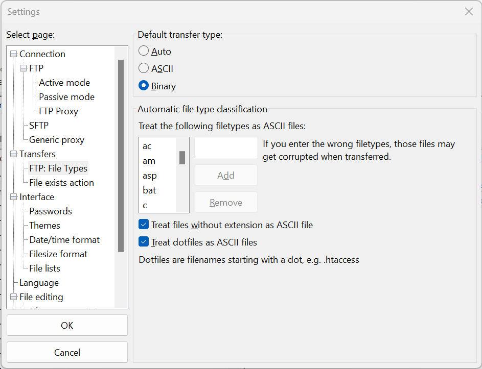
   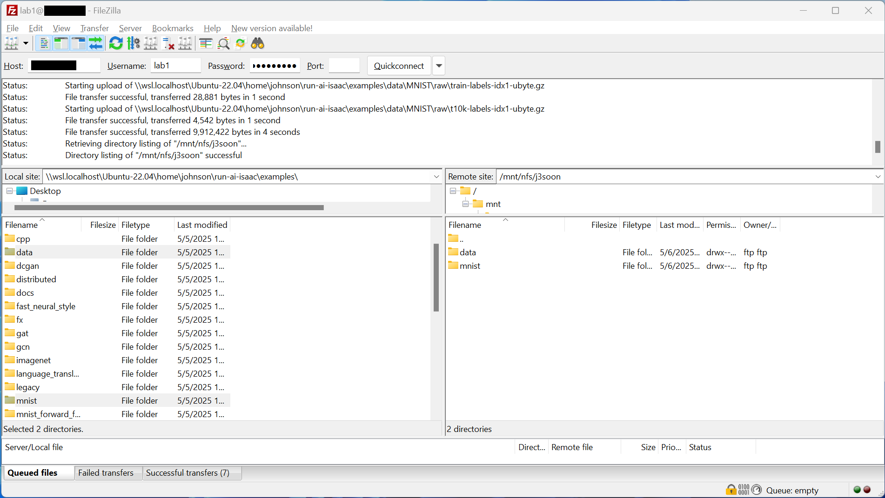

   For `lftp`, on your local machine run:

   ```sh
   source secrets/env.sh 
   # Install and set up lftp
   sudo apt-get update && sudo apt-get install -y lftp
   echo "set ssl:verify-certificate no" >> ~/.lftprc
   # Connect to storage node
   lftp -u ${FTP_USER},${FTP_PASS} ${STORAGE_NODE_IP}
   ```

   Inside the `lftp` session, run:

   ```sh
   cd /mnt/nfs
   ls
   mkdir <YOUR_USERNAME>
   cd <YOUR_USERNAME>
   # Delete old dataset and code
   rm -r data
   rm -r mnist
   # Upload dataset and code
   mirror --reverse examples/data data
   mirror --reverse examples/mnist mnist
   # Don't close this session just yet, we will need it later
   ```

   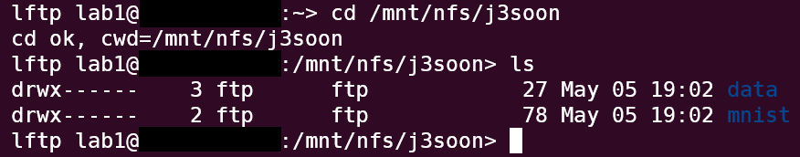

   When uploading a newer version of your code or dataset, always delete the existing directory first. This ensures that any files removed in the new version are not left behind. If you expect you will run a newer version of your code while previous tasks are still running, consider implementing a versioning system by including a version tag in the file path to prevent conflict.

4. Create a new environment for your docker image.

   Go to `Workload manager > Assets > Environments` and click `+ NEW ENVIRONMENT`.

   ```
   Scope: runai/runai-cluster/<YOUR_LAB>/<YOUR_PROJECT>
   Environment name: <YOUR_USERNAME>-pytorch-mnist
   Select the type of workload that can use this environment:
     Workspace: (Checked)
     Training: (Unchecked)
     Inference: (Unchecked)
   Image:
     Image URL: j3soon/runai-pytorch-mnist
     Image pull policy: Always pull the image from the registry
   Tools:
     Tool: Jupyter
   Runtime settings:
     Command: /run.sh "pip install jupyterlab" "jupyter lab --ip=0.0.0.0 --no-browser --allow-root --NotebookApp.base_url=/${RUNAI_PROJECT}/${RUNAI_JOB_NAME} --NotebookApp.token='' --notebook-dir=/"
     Arguments: (Empty)
   ```

   and then click `CREATE ENVIRONMENT`.

   You should create a new environment for each docker image you want to use. In most cases, you will only need to create one environment. In addition, you can add more tools to the environment, such as TensorBoard, or opening custom ports using the `Custom` tool and `NodePort` connection type.

   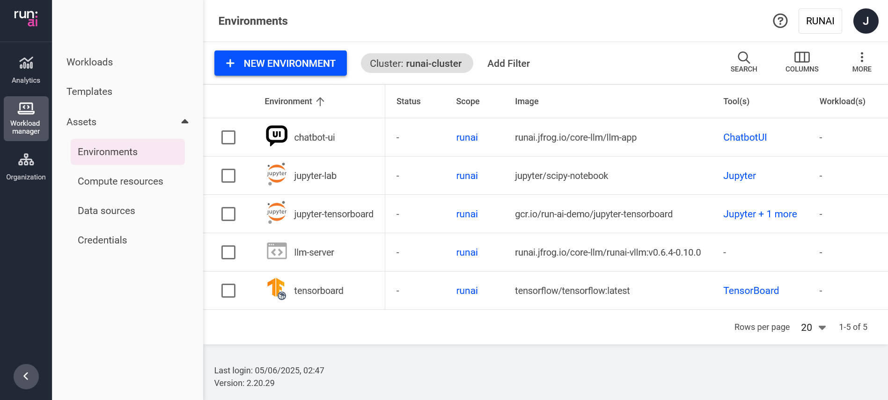
   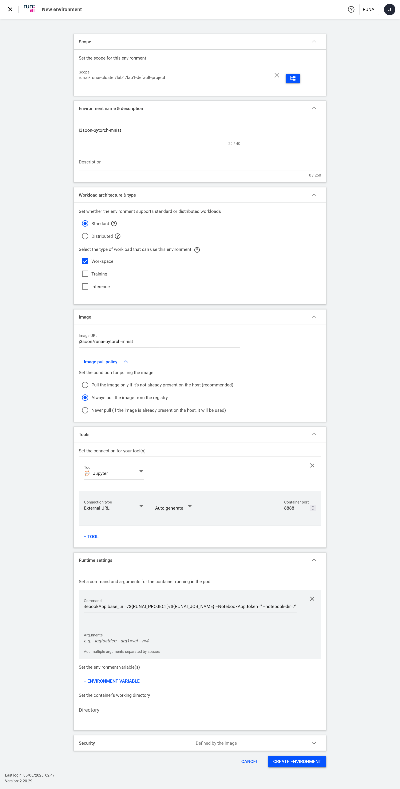
   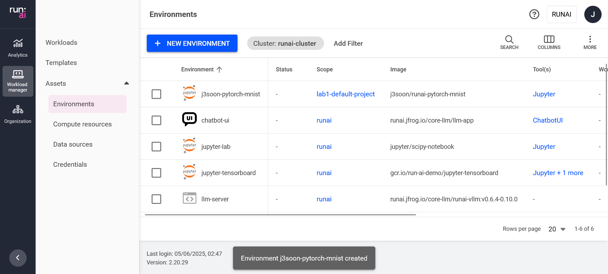

5. Create a new GPU workload based on the environment.

   Go to `Workload manager > Workloads` and click `+ NEW WORKLOAD > Workspace`.

   ```
   Workspace name: <YOUR_USERNAME>-pytorch-mnist-test1
   ```

   and click `CONTINUE`.

   ```
   Environment:
     Select the environment for your workload: <YOUR_USERNAME>-pytorch-mnist
   Compute resource:
     Select the node resources needed to run your workload: gpu1
   Data sources:
     Select the data sources your workload needs to access: <YOUR_LAB>-nfs
   General:
     Set the backoff limit before workload failure:
       Attempts: 1
   ```

   and then click `CREATE WORKSPACE`.

   > The `/run.sh` file mentioned here is the same `run.sh` script that was copied directly into the Docker image without any modifications during the second step. This pre-written helper script streamlines file downloads and uploads to and from Nucleus while also supporting the sequential execution of multiple commands.  

   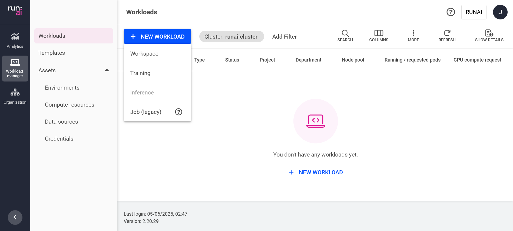
   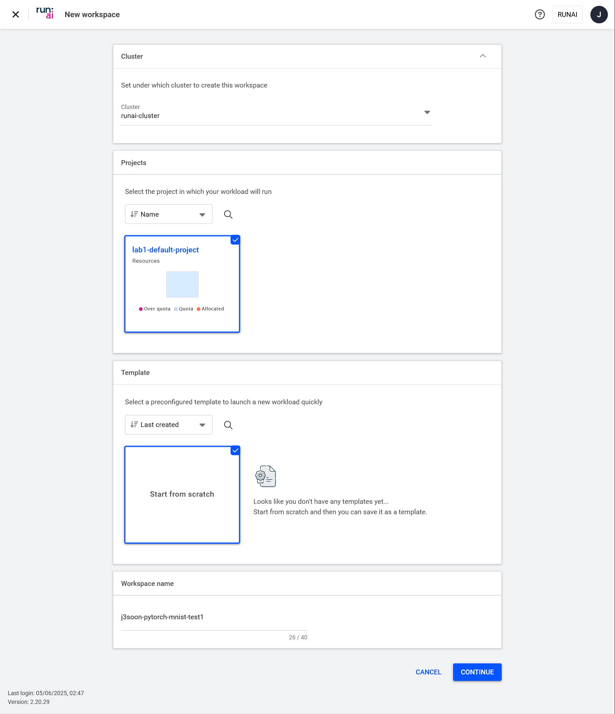
   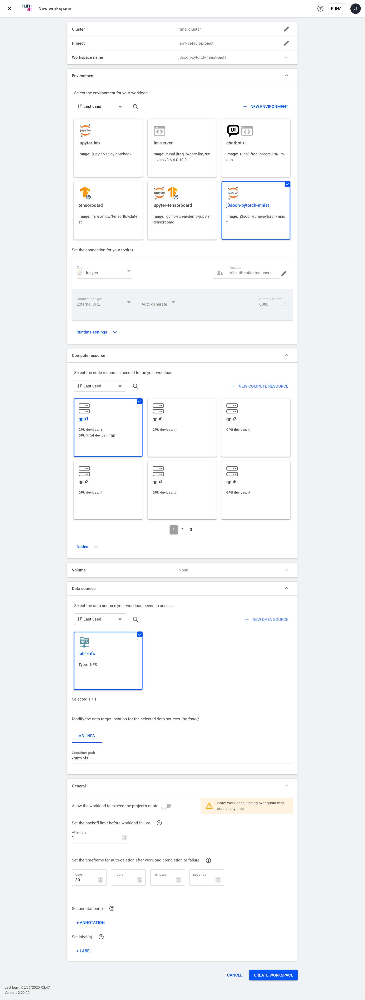
   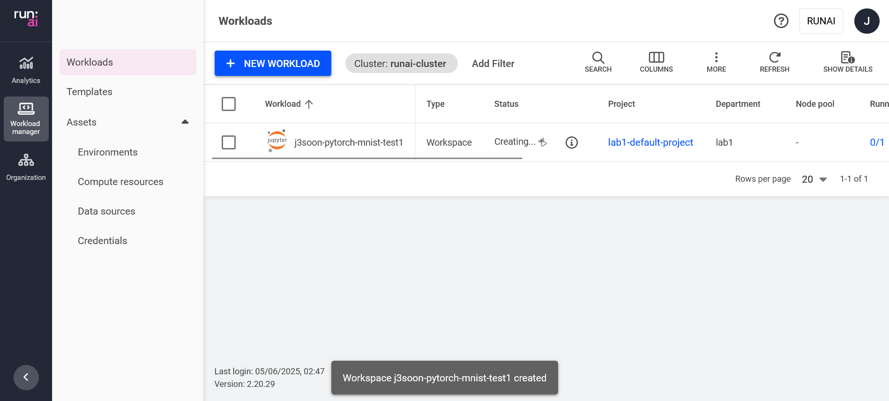

6. Connect to the Jupyter Lab.

   In `Workload manager > Workloads`, select the workload you just created and click `CONNECT > Jupyter` and click `Terminal`.

   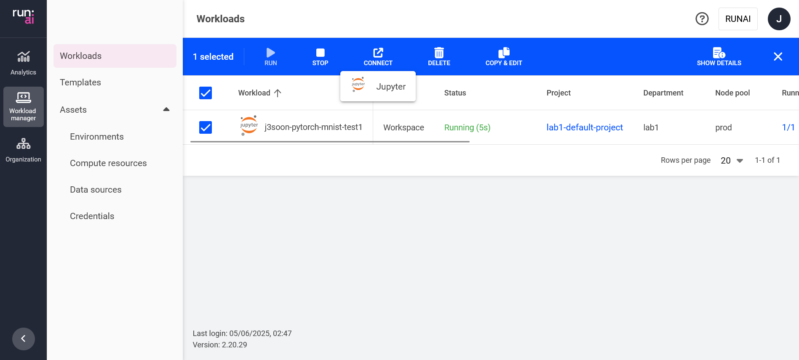
   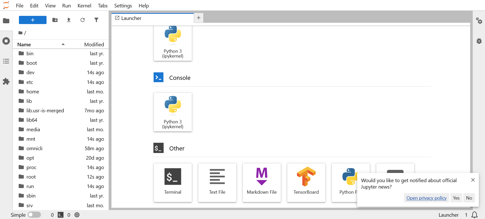

7. Extract the dataset.

   In the Jupyter Lab terminal, run:

   ```sh
   cd /mnt/nfs/<YOUR_USERNAME>/data/MNIST/raw
   ls
   gzip -dk train-images-idx3-ubyte.gz
   gzip -dk train-labels-idx1-ubyte.gz
   gzip -dk t10k-images-idx3-ubyte.gz
   gzip -dk t10k-labels-idx1-ubyte.gz
   ls
   ```
   > Although `/mnt/nfs` is a Network File System (NFS) mounted volume, it typically isn't the bottleneck during training. However, if you notice that your dataloader is causing performance issues, consider copying the dataset to the container's local storage before starting the training process. The NFS volume may also cause issues if you are using `tar` on the mounted volume, make sure to use the `--no-same-owner` flag to prevent the `tar: XXX: Cannot change ownership to uid XXX, gid XXX: Operation not permitted` error.

   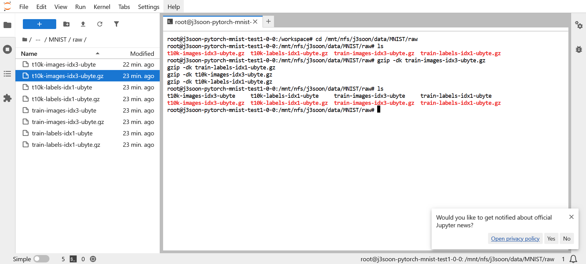

8. Start Training.

   In the Jupyter Lab terminal, run:

   ```sh
   nvidia-smi
   apt-get update
   apt-get install -y tree
   tree /mnt/nfs/<YOUR_USERNAME>/data
   cd /mnt/nfs/<YOUR_USERNAME>/mnist
   pip install -r requirements.txt
   python main.py --save-model --epochs 1
   ```
   > The `apt-get install` and `pip install` commands here are only for demonstration purposes, installing packages during runtime is not recommended, as it can slow down the task and potentially cause issues. It is recommended to include all dependencies in the Docker image by specifying them in the Dockerfile.
   >
   > Make sure to store all checkpoints and output files in `/mnt/nfs`. Otherwise, after the container is terminated, all files outside of `/mnt/nfs` (including the home directory) will be permanently deleted. This is because containers are ephemeral and only the NFS mount persists between runs.

   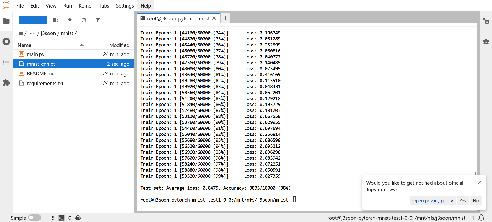

9. Download the results.

   Inside the previous `lftp` session, run:

   ```sh
   cd /mnt/nfs/<YOUR_USERNAME>/mnist
   cache flush
   ls
   # Download the results
   get mnist_cnn.pt
   rm mnist_cnn.pt
   ```

   Make sure to delete the results after downloading to save storage space.

   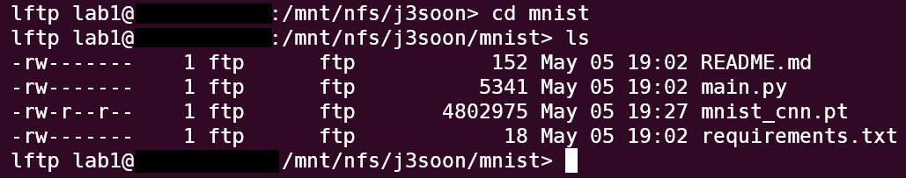

10. Delete the workload.

    Go to `Workload manager > Workloads` and select the workload you just created and click `DELETE`. Please always delete the workload after you are done with the task to allow maximum resource utilization.

    Also note that clicking `STOP` will also delete the container. You won't want to click this button in most cases.

    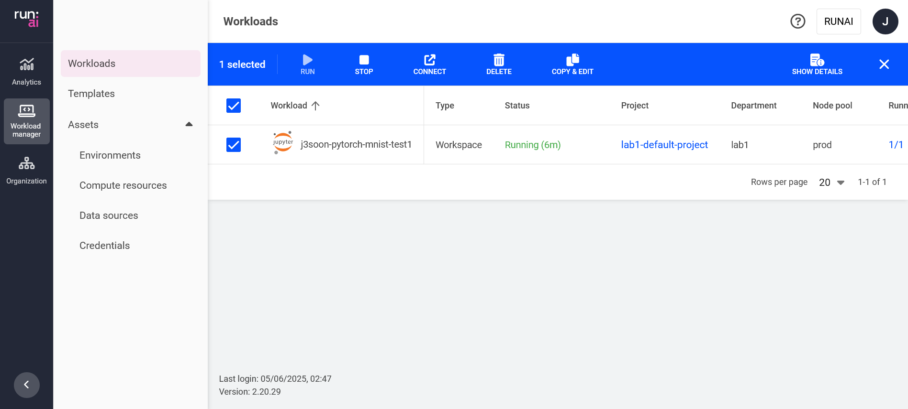

11. (Optional) Alternative to interactive Jupyter Lab workloads, you may want to submit a batch workload.

    Go to `Workload manager > Workloads` and click `+ NEW WORKLOAD > Batch`.

    ```
    Workspace name: <YOUR_USERNAME>-pytorch-mnist-test2
    ```

    and click `CONTINUE`.

    ```
    Environment:
      Select the environment for your workload: <YOUR_USERNAME>-pytorch-mnist
      Set a command and arguments for the container running in the pod:
        Command: /run.sh "cd /mnt/nfs/<YOUR_USERNAME>/mnist" "python main.py --save-model --epochs 1"
    Compute resource:
      Select the node resources needed to run your workload: gpu1
    Data sources:
      Select the data sources your workload needs to access: <YOUR_LAB>-nfs
    General:
      Set the backoff limit before workload failure:
        Attempts: 1
    ```

    and then click `CREATE WORKSPACE`.

    Note that the batch workload will not automatically restart when it fails since we set the backoff limit to 1. There is currently no way to set the backoff limit to 0, so make sure a workload restart will not overwrite your previous results.

    After the workload is completed, click `SHOW DETAILS` to see the logs.

    
    
    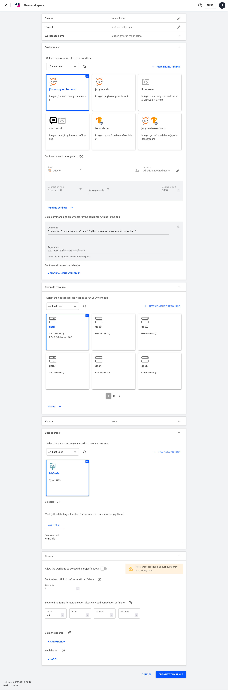
    
    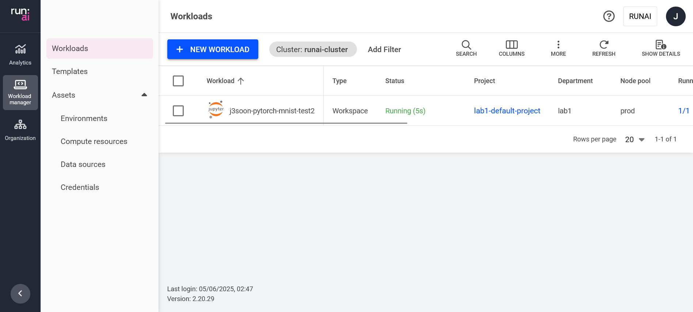
    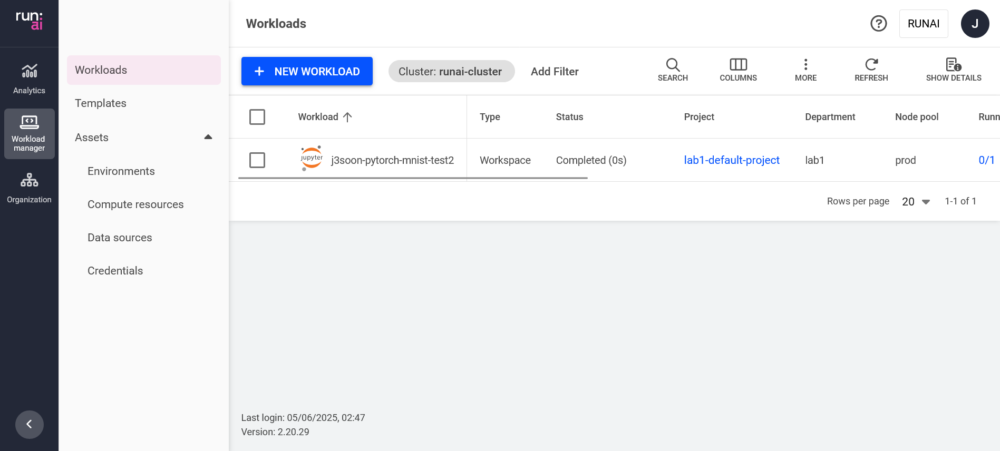
    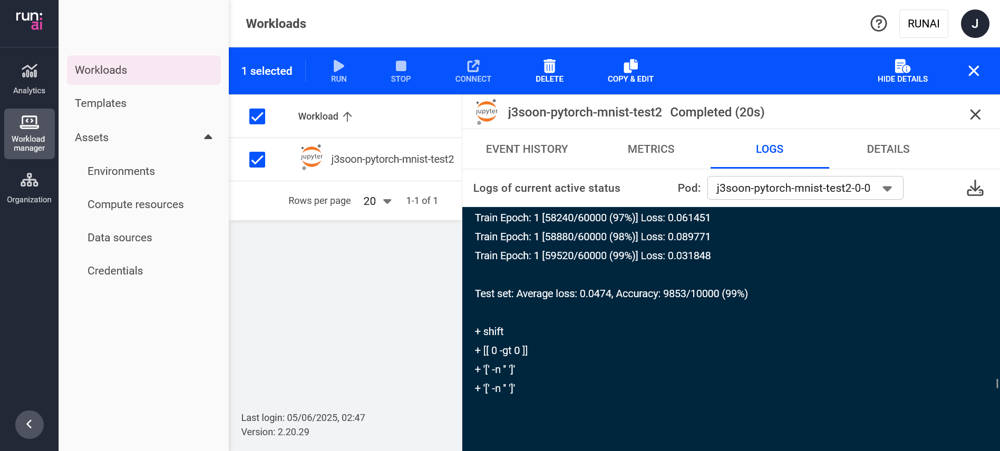

> Make sure to always add your username as a prefix to your environment name and workload name. This helps preventing others from accidentally modifying your setups.

> As a side note, you may want to use [Wandb](https://wandb.ai/site/) to [log](https://docs.wandb.ai/ref/python/log/) your training results. This allows you to visualize your training progress of all your workloads in a single dashboard.

### Isaac Sim Workloads

> To be added.

## Acknowledgements

I must thank [Kuan-Ting Yeh](https://github.com/timost1234) for his invaluable support in investigating and resolving various issues, whether it was day or night, weekday or weekend.

Disclaimer: this is not an official NVIDIA product.

## More Information

For more information on how to use Run:ai, please refer to the [Run:ai Documentation](https://run-ai-docs.nvidia.com/).
