# Isaac Sim (Extended) with ROS 2

> Experimental: These unofficial Docker images are under active development, with more thorough testing planned in the near future.

This is a series of unofficial Docker images for Isaac Sim (Extended) with ROS 2 installed on top of the Ubuntu 24.04 base image. "Extended" refers to the additional built-in support for Jupyter Lab, VS Code Server, TigerVNC, noVNC, and OpenSSH Server. The instructions cover running the images locally, on Run:ai, and on Brev, but they can be easily adapted to other platforms or re-built with other base images.

If you encounter any issues or have any questions, please [open an issue](https://github.com/j3soon/runai-isaac/issues).

## Build (Optional)

> Skip this section if you want to use our pre-built docker images on Docker Hub.

Build the docker image:

```sh
# Isaac Sim 5.1.0 + ROS 2 Jazzy
docker build -t j3soon/runai-isaac-sim-ex:5.1.0-ros2-jazzy -f docker/isaac-sim-ex-ros2/Dockerfile_5_1_0_ros2_jazzy .
docker push j3soon/runai-isaac-sim-ex:5.1.0-ros2-jazzy
# Isaac Sim 6.0.0 + ROS 2 Jazzy
docker build -t j3soon/runai-isaac-sim-ex:6.0.0-ros2-jazzy -f docker/isaac-sim-ex-ros2/Dockerfile_6_0_0_ros2_jazzy .
docker push j3soon/runai-isaac-sim-ex:6.0.0-ros2-jazzy
# Isaac Sim 6.0.1 + ROS 2 Jazzy
docker build -t j3soon/runai-isaac-sim-ex:6.0.1-ros2-jazzy -f docker/isaac-sim-ex-ros2/Dockerfile_6_0_1_ros2_jazzy .
docker push j3soon/runai-isaac-sim-ex:6.0.1-ros2-jazzy
```

> **Note:** These images are self-contained (Ubuntu 24.04 base, not the official Isaac Sim container) and download Isaac Sim (~10 GB) during the build. Build time is significantly longer than the other variants. They include ROS 2 Jazzy.

## Run:ai

> Skip this section if you're not using Run:ai.

Refer to [Isaac Sim (Extended) Interactive Workspace](../isaac-sim-ex/README.md) for Run:ai setup instructions. You only need to change the image URL to one of the ROS 2 variants below:

| Isaac Sim | ROS 2 | Image URL |
|-----------|-------|-----------|
| 5.1.0 | Jazzy | j3soon/runai-isaac-sim-ex:5.1.0-ros2-jazzy |
| 6.0.0 | Jazzy | j3soon/runai-isaac-sim-ex:6.0.0-ros2-jazzy |
| 6.0.1 | Jazzy | j3soon/runai-isaac-sim-ex:6.0.1-ros2-jazzy |

## Brev

> Skip this section if you're not using Brev.

| Isaac Sim | ROS 2 | Brev URL |
|-----------|-------|----------|
| 5.1.0 | Jazzy | [](https://brev.nvidia.com/launchable/deploy?launchableID=env-3FXbyeSSuSfQ1M3QBpn8dS6RMJ3) |
| 6.0.0 | Jazzy | [](https://brev.nvidia.com/launchable/deploy?launchableID=env-3FXrBBVrTrAyVjAgUoq9SiXUIgB) |

1. Click one of the Brev badges above to navigate to the Brev launchable page. (We suggest Isaac Sim 5.1.0 + ROS 2 Jazzy as default)
   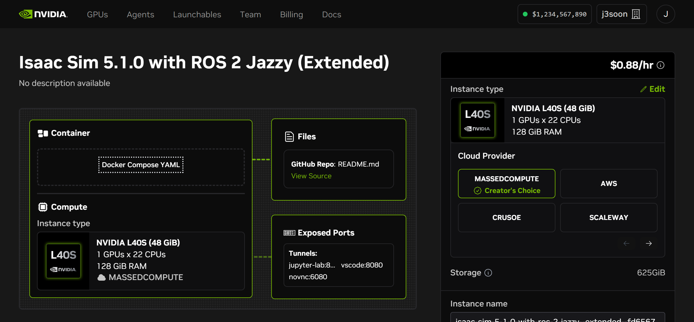
1. (Optional) If you haven't logged in to Brev, click `Sign In`, you will be prompted to log in or register. After logging in, you will be redirected back to the launchable page.
1. (Optional) If you have multiple Brev organizations, make sure to select the correct one from the dropdown menu in the top right corner of the page.
1. Click `Deploy Launchable`, and wait for provisioning to complete. (If it failed, delete and re-deploy the launchable.)
   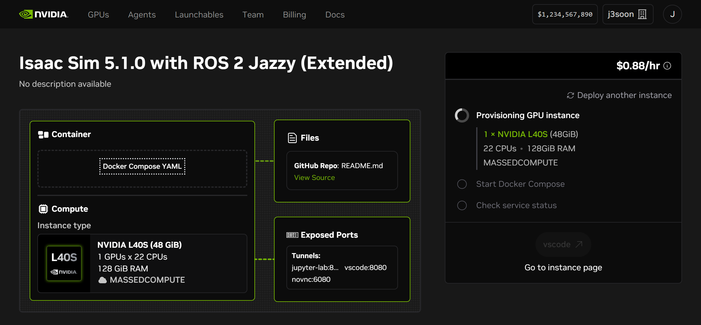
1. Click `Go to instance page` to open the Brev workspace in a new browser tab.
   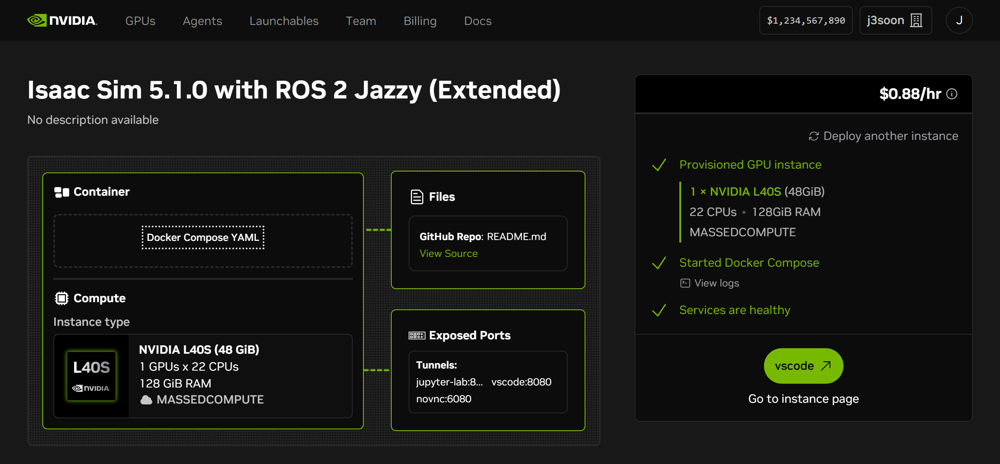
1. Click `novnc`, and then click `Connect`.
   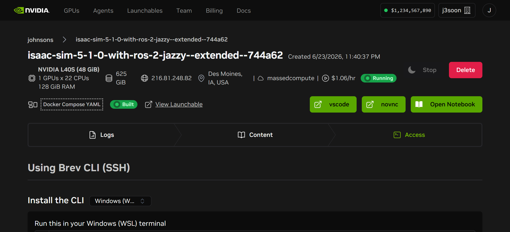
   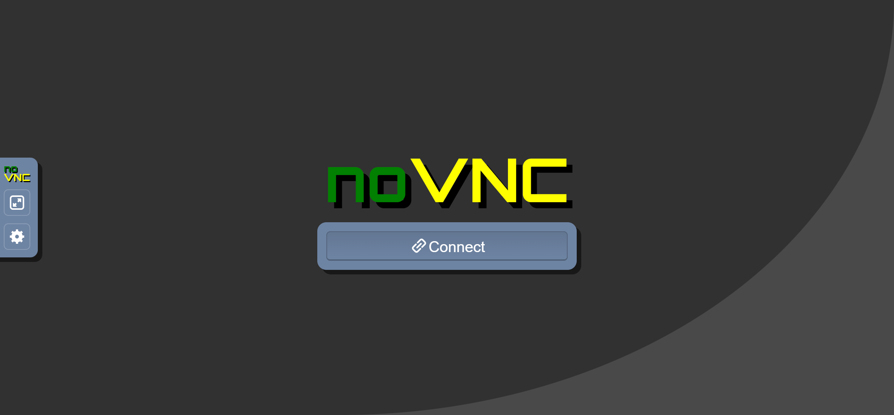
1. Set the noVNC `Settings > Scaling Mode` to `Remote Resizing`, and hide the settings sidebar.
   > As a side note, for copying and pasting between host and the noVNC session, you can use the `Clipboard` on the left toolbar.
   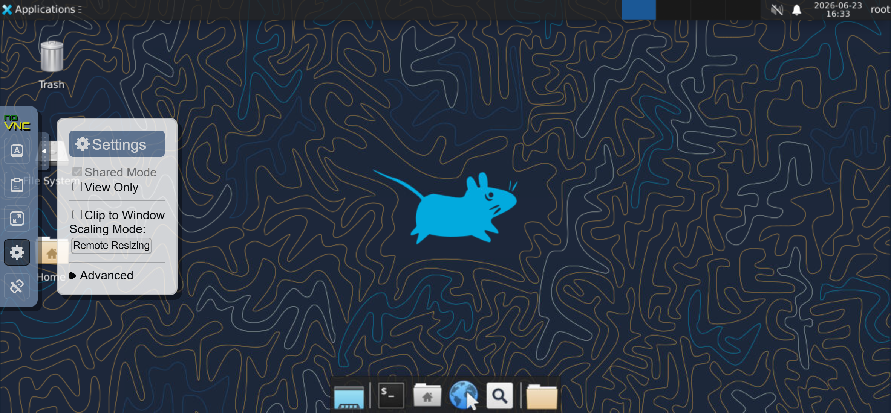
1. Open a terminal with `Applications > Terminal Emulator`, and run `~/isaacsim/isaac-sim.sh` to launch Isaac Sim. Wait a while for the first launch to complete. (If it crashes, re-launch it.)
   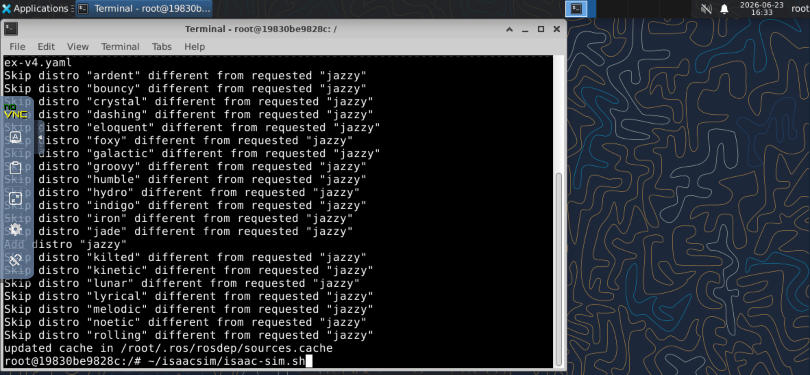
   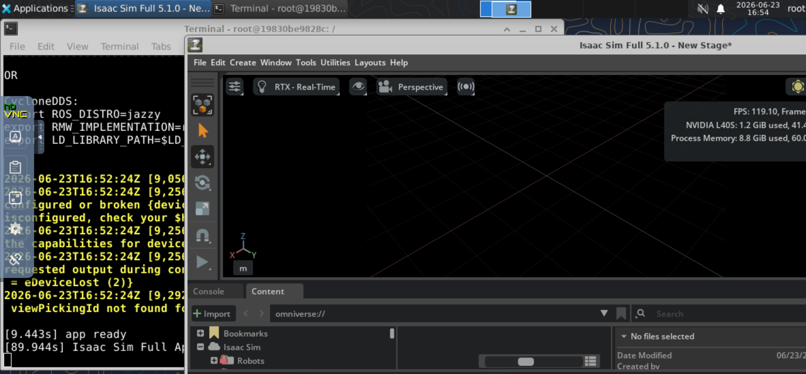
1. In Isaac Sim GUI, click `Tools > Robotics > ROS 2 OmniGraphs > Clock`, and then click `OK` to add the ROS 2 Clock OmniGraph to the scene. This will allow you to publish simulator clock via ROS 2 from Isaac Sim.
   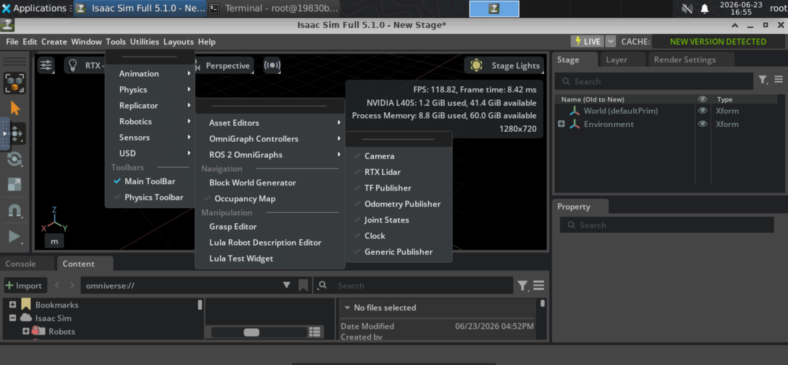
   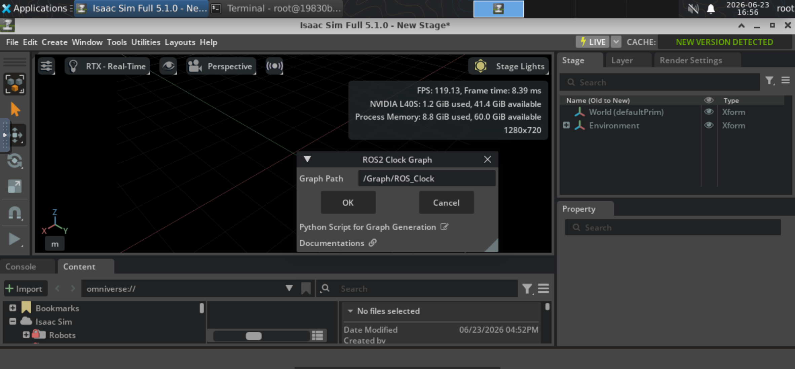
1. Click the `Play` button to start Isaac Sim simulation. Open another terminal and run `ros2 topic list` and `ros2 topic echo /clock`, and confirm the clock messages are being published from Isaac Sim.
   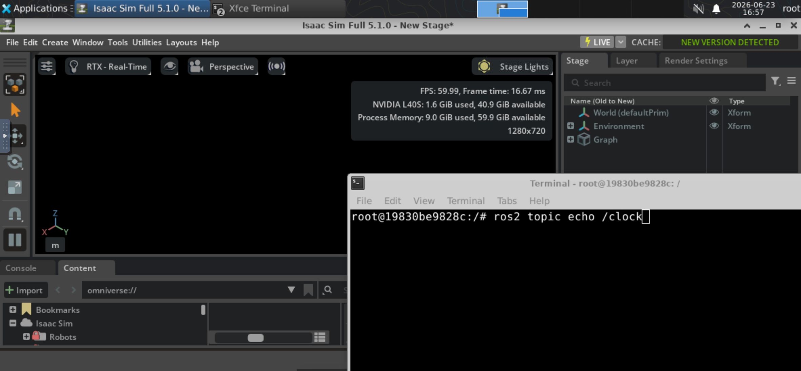
   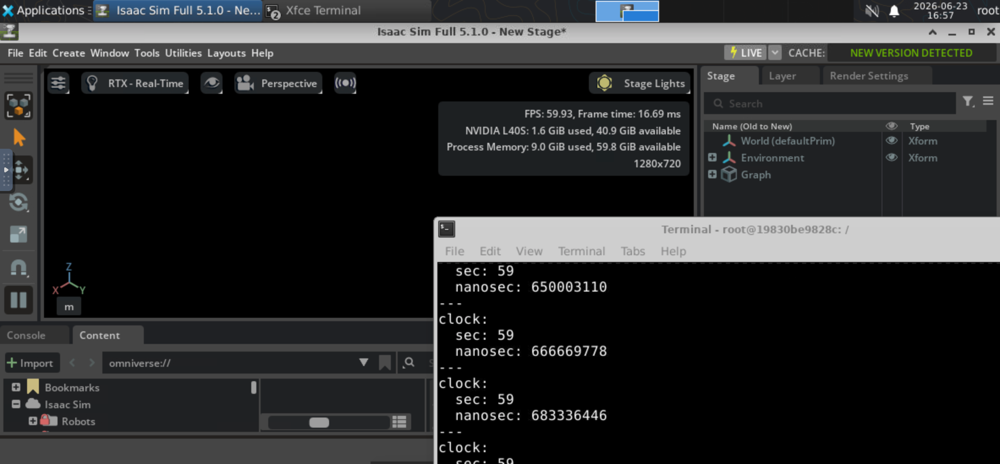
1. Store files such as code and data at `/workspace`, since the docker container mounts the host `/workspace` into the container.

Additional notes:

At the time of writing, we selected Massed Compute as our default provider, as it costs $1.06/hr for x1 L40S GPU (48GB VRAM), x22 CPUs (AMD EPYC 9224 24-Core Processor), 128GB RAM, and 625GB storage (HDD), which has the minimal cost. Changing to other providers should be fine. In the future we plan to test other providers and GPU setups in case this instance type has been used up.

The Brev CLI shell commands, will access a VM host, where you can use docker commands like `docker ps -a` to see the running containers:

```sh
brev login --token <token>
brev set <org>
brev shell isaac-sim-5-1-0-with-ros-2-jazzy--extended--xxxxxx
```

## Local

```sh
# Ref: https://docs.isaacsim.omniverse.nvidia.com/latest/installation/install_container.html#container-deployment
# Ref: https://github.com/j3soon/docker-isaac-sim
mkdir -p ~/docker/isaac-sim/cache/main/ov
mkdir -p ~/docker/isaac-sim/cache/main/warp
mkdir -p ~/docker/isaac-sim/cache/computecache
mkdir -p ~/docker/isaac-sim/config
mkdir -p ~/docker/isaac-sim/data/documents
mkdir -p ~/docker/isaac-sim/data/Kit
mkdir -p ~/docker/isaac-sim/logs
mkdir -p ~/docker/isaac-sim/pkg

xhost +local:docker
docker run --rm -it --gpus all -e "ACCEPT_EULA=Y" \
  -p 12222:22 -p 15900:5900 -p 16080:6080 -p 18888:8888 -p 18080:8080 \
  -e "PRIVACY_CONSENT=Y" \
  -v ~/docker/isaac-sim/cache/main:/root/.cache:rw \
  -v ~/docker/isaac-sim/cache/computecache:/root/.nv/ComputeCache:rw \
  -v ~/docker/isaac-sim/logs:/root/.nvidia-omniverse/logs:rw \
  -v ~/docker/isaac-sim/config:/root/.nvidia-omniverse/config:rw \
  -v ~/docker/isaac-sim/data:/root/.local/share/ov/data:rw \
  -v ~/docker/isaac-sim/pkg:/root/.local/share/ov/pkg:rw \
  -v $(pwd):/app \
  j3soon/runai-isaac-sim-ex:6.0.1-ros2-jazzy  # or :6.0.0-ros2-jazzy / :5.1.0-ros2-jazzy
```

You can also use the Docker Compose files:

```sh
docker compose -f docker/isaac-sim-ex-ros2/compose_6_0_1_ros2_jazzy.yaml up
```

## Developer Notes

Currently we've only quickly tested ROS 2 clock and images. We plan to perform a more thorough Isaac Sim and ROS 2 communication test in the near future.

Although Isaac Sim is fully GPU-accelerated due to the use of Vulkan (verified by ~120 FPS on empty scene), we suspect ROS 2 RViz may be using llvmpipe (CPU) for rendering, as we only get ~2000 FPS on `glxgears`. We plan to further improve this potentially with VirtualGL and TurboVNC in the future.

Isaac Sim 6.0 seems to have only ~25 FPS on empty scene during our quick test. Not sure if this is an issue on our side or just a faulty instance. Need further investigation.

We intentionally install Isaac Sim via binary instead of pip, since the accompanied source code and example code can greatly help AI agents to write new code.

Isaac Lab, CUDA, PyTorch, are intentionally left out in the current build, planning to add a suitable version soon.
