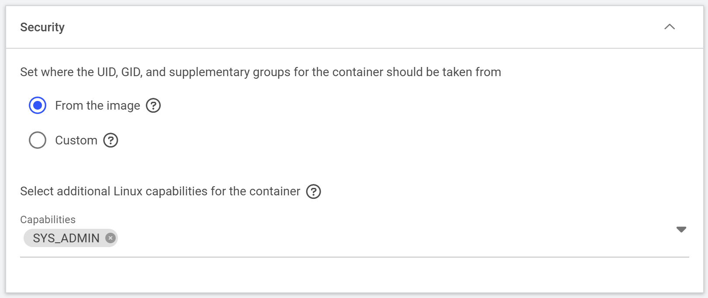

# NVHPC

This page is part of the sample applications guide. Follow [README](../../README.md) first and stop interactive workloads when finished.

1. (Optional) Create a docker image for [NVHPC](https://catalog.ngc.nvidia.com/orgs/nvidia/containers/nvhpc/tags):

   ```sh
   docker build -f docker/nvhpc/Dockerfile_25.5-devel-cuda_multi-ubuntu22.04 . -t j3soon/runai-nvhpc:25.5-devel-cuda_multi-ubuntu22.04
   docker push j3soon/runai-nvhpc:25.5-devel-cuda_multi-ubuntu22.04
   ```

2. Launch a workspace using the docker image `j3soon/runai-nvhpc:25.5-devel-cuda_multi-ubuntu22.04`

   Environment command:

   ```
   /run.sh "pip install jupyterlab" "jupyter lab --ip=0.0.0.0 --no-browser --allow-root --NotebookApp.base_url=/${RUNAI_PROJECT}/${RUNAI_JOB_NAME} --NotebookApp.token='' --notebook-dir=/"
   ```

   Security Setup (for Nsight Systems/Compute profiling inside container):

   ```
   Select additional Linux capabilities for the container:
   - SYS_ADMIN
   ```

   

   Reference: [Nsight Systems User Guide](https://docs.nvidia.com/nsight-systems/UserGuide/index.html#container-and-scheduler-support)

3. Run the following in Jupyter Lab terminal:

   ```sh
   cd ~
   wget https://raw.githubusercontent.com/j3soon/runai-isaac/refs/heads/main/docker/nvhpc/real-hello-world.cu
   nvcc -arch=native -lineinfo real-hello-world.cu
   ./a.out
   ```

   This should print `Hello World` in the terminal.

4. Use Nsight Systems to profile the application:

   ```sh
   nsys profile --stats=true -t nvtx,cuda ./a.out
   ```

   This should output a `report1.nsys-rep` file, which can be opened with Nsight Systems GUI.

   > If you have trouble running `nsys`, check the system status:
   >
   > ```sh
   > nsys status -e
   > ```

   Reference: [Nsight Systems User Guide](https://docs.nvidia.com/nsight-systems/UserGuide/index.html)

5. Use Nsight Compute to profile the application:

   ```sh
   ncu ./a.out
   ```

   This should output an error message:

   ```
   ==ERROR== An error was reported by the driver:
   ==ERROR== Profiling failed because a driver resource was unavailable. Ensure that no other tool (like DCGM) is concurrently collecting profiling data. See https://docs.nvidia.com/nsight-compute/ProfilingGuide/index.html#faq for more details.
   ```

   This is because NVIDIA GPU Operator runs DCGM to collect GPU metrics in the background by default. Contact the administrator to temporarily disable DCGM for the particular node.

   > For admins:
   >
   > ```sh
   > # Set the workload name
   > WORKLOAD_NAME=j3soon-nvhpc
   > kubectl get pods -A -o wide | grep ${WORKLOAD_NAME}
   > # You should see the node name
   > # Set the node name
   > NODE_NAME=ovx01
   > kubectl get pods -A -o wide | grep ${NODE_NAME}
   > # Ref: https://github.com/NVIDIA/gpu-operator/issues/247#issuecomment-906106623
   > kubectl label node $NODE_NAME --overwrite nvidia.com/gpu.deploy.dcgm=false
   > kubectl label node $NODE_NAME --overwrite nvidia.com/gpu.deploy.dcgm-exporter=false
   > ```
   >
   > and after the user finished profiling, run the following:
   >
   > ```sh
   > kubectl label node $NODE_NAME --overwrite nvidia.com/gpu.deploy.dcgm=true
   > kubectl label node $NODE_NAME --overwrite nvidia.com/gpu.deploy.dcgm-exporter=true
   > ```
   >
   > If you somehow lost track of which node has DCGM disabled, you can run the following command to list all nodes:
   >
   > ```sh
   > kubectl get nodes --show-labels | grep dcgm=false
   > kubectl get nodes --show-labels | grep dcgm-exporter=false
   > ```

   Continue with Nsight Compute profiling:

   ```sh
   ncu --import-source 1 -o report --set full -f ./a.out
   ```

   This should output a `report.ncu-rep` file, which can be opened with Nsight Compute GUI.

   Reference: [Nsight Compute Documentation](https://docs.nvidia.com/nsight-compute/index.html)
