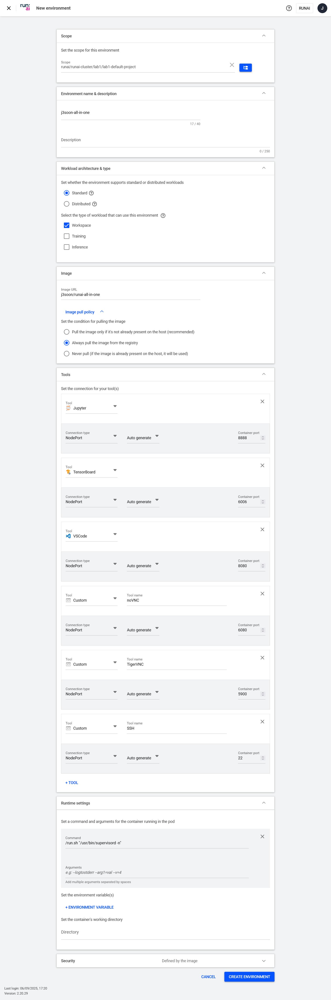
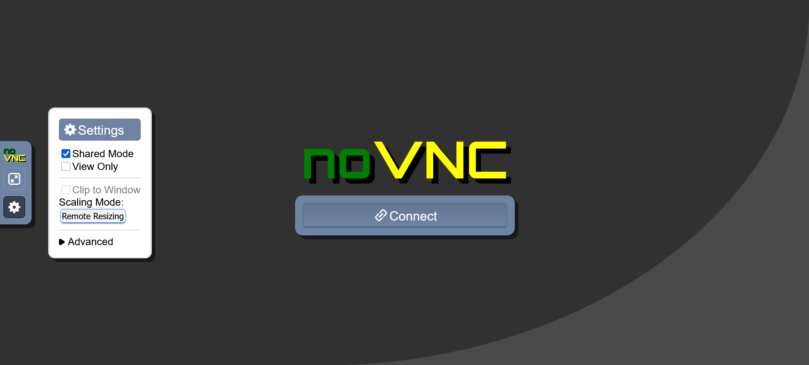

# Sample Applications

This document assumes you have already followed the [README](../README.md) and understand the basic concepts of Run:ai.

Please note that interactive workloads are only for debugging, and should be stopped and deleted when finished. See [Running Your Workloads](../README.md#running-your-workloads) for the usage guidelines.

## All-In-One Interactive Workspace

> You can skip this section if you plan to only submit batch workloads, such as non-interactive Isaac Sim and Isaac Lab training tasks.

We take the All-In-One workspace as a comprehensive example that includes multiple tools for development and debugging.

1. (Optional) Create a docker image for [All-In-One Workspace](https://github.com/j3soon/runai-isaac/blob/main/docker/all-in-one/Dockerfile):

   ```sh
   docker build -t j3soon/runai-all-in-one -f docker/all-in-one/Dockerfile .
   docker push j3soon/runai-all-in-one
   ```

   > This step is optional since we provide pre-built docker images on Docker Hub.

2. Create a new environment for your docker image.

   Go to `Workload manager > Assets > Environments` and click `+ NEW ENVIRONMENT`.

   Fill in the following fields:

   - Scope
     ```
     runai/runai-cluster/<YOUR_LAB>/<YOUR_PROJECT>
     ```
   - Environment name
     ```
     <YOUR_USERNAME>-all-in-one
     ```
   - Workload architecture & type
     - Select the type of workload that can use this environment:
       ```
       Workspace: ✅ (Checked)
       Training: ⬜ (Unchecked)
       Inference: ⬜ (Unchecked)
       ```
   - Image
     - Image URL
       ```
       j3soon/runai-all-in-one
       ```
     - Image pull policy
       ```
       Always pull the image from the registry
       ```
   - Tools
     - Tool
       ```
       Jupyter
       Connection type: NodePort (Auto generate)
       Container port: 8888
       ```
     - Tool
       ```
       TensorBoard
       Connection type: NodePort (Auto generate)
       Container port: 6006
       ```
     - Tool
       ```
       VSCode
       Connection type: NodePort (Auto generate)
       Container port: 8080
       ```
     - Tool
       ```
       Custom - noVNC
       Connection type: NodePort (Auto generate)
       Container port: 6080
       ```
     - Tool
       ```
       Custom - TigerVNC
       Connection type: NodePort (Auto generate)
       Container port: 5900
       ```
     - Tool
       ```
       Custom - SSH
       Connection type: NodePort (Auto generate)
       Container port: 22
       ```
   - Runtime settings
     - Command
       ```
       /run.sh "/usr/bin/supervisord -n"
       ```
     - Arguments: (Keep empty)
   - Security
     - Set where the UID, GID, and supplementary groups for the container should be taken from
       ```
       From the image
       ```
       > In newer versions of Run:ai, the default value may be `From the IdP token`.

   and then click `CREATE ENVIRONMENT`.

   

3. Create a new GPU workload based on the environment.

   Go to `Workload manager > Workloads` and click `+ NEW WORKLOAD > Workspace`.

   Fill in the following fields:

   - Workspace name
     ```
     <YOUR_USERNAME>-all-in-one-test
     ```

     and click `CONTINUE`.

   - Environment
     - Select the environment for your workload:
       ```
       <YOUR_USERNAME>-all-in-one
       ```
     - (Optional) Set the connection for your tool(s):
       ```
       Tool Access: Set to Specific user(s)
       ```
   - Compute resource
     - Select the node resources needed to run your workload:
       ```
       gpu-x1
       ```
   - Data sources
     - Select the data sources your workload needs to access:
       ```
       <YOUR_LAB>-nfs
       ```
   - General
     - Set the backoff limit before workload failure:
       ```
       Attempts: 0
       ```

   and then click `CREATE WORKSPACE`.

4. Connect to the tools.

   In `Workload manager > Workloads`, select the workload you just created and click `CONNECT` to access various tools.

   > When using multiple tools within a single environment, the tool ports may be randomly reordered due to a Run:ai bug (which I believe is fixed in the latest version). See the [developer notes](./developer-notes.md#be-aware-that-runai-tool-urls-may-reorder-randomly) for more details.
   >
   > In this case, you can still identify the correct tool port by trial-and-error. For admins, use `kubectl get services -n runai-<PROJECT_NAME>` to bypass trial-and-error.

5. (Optional) Test every tools.

   Open all 6 tools in the browser. You should notice that the link ports are not the same in those inside the container. For example, SSH inside the container is `22` port, but the link port may be `33333`. This is because the ports are exposed through K8s `NodePort`.

   Jupyter Lab, web-based VSCode, and TensorBoard are straightforward to use. For applications that require GUI (such as Isaac Sim and Isaac Lab interactive mode), you can use the noVNC tool. It should show the GUI, and you'll want to set the `Scaling Mode` to `Remote Resizing`. noVNC is the recommended tool for GUI applications, however you can also use VNC viewers to connect directly to the VNC port. Last but not least, the SSH port can connect to the container, and can also be used for local VSCode `Remote Development` feature.

   

6. Delete the workload.

   Go to `Workload manager > Workloads` and select the workload you just created and click `DELETE`. Please always `STOP` or `DELETE` the workload after you are done with the task to allow maximum resource utilization.

Always store your data under the `/mnt/nfs/<YOUR_USERNAME>` directory to ensure your results persist even after the container is terminated.

To add these tools to your custom docker image, refer to [j3soon/dockerfile-fragments](https://github.com/j3soon/dockerfile-fragments).

Before moving on, make sure you are familiar with the noVNC tool, this is required to access the following GUI applications. In addition, if planning to use interactive GUI for the following applications, the Environment Template should follow the `all-in-one` template, such as the command should use the `/run.sh "/usr/bin/supervisord -n"` command instead of those used in non-interactive jobs.

> Note that for the following applications, docker images without the `-ex` suffix are for non-interactive jobs, and docker images with the `-ex` suffix are for interactive jobs. The Environment Template are also different for these two types of jobs. If you encountered errors such as unable to access the VNC desktop, inspect the `all-in-one` case carefully, and make sure you have grasped the concept of the `all-in-one` docker image and Environment Template.

> Moving forward, you can only expose the ports of the tools you need, and hide the rest to reduce the impact of the tool reordering bug. For example, if you only need noVNC, you can expose only port 6080 in your Environment Template. This will make it easier to identify which port corresponds to which tool, since there will be fewer ports to check.

## Isaac Sim Headless Workspace

We take [Isaac Sim](https://docs.isaacsim.omniverse.nvidia.com/latest/index.html) headless simulation as an example for batch workloads that don't require GUI interaction.

1. (Optional) Create a docker image for [Isaac Sim Workspace](https://github.com/j3soon/runai-isaac/blob/main/docker/isaac-sim/Dockerfile_4_5_0) following the [installation guide](https://docs.isaacsim.omniverse.nvidia.com/latest/installation/install_container.html):

   ```sh
   docker build -t j3soon/runai-isaac-sim:4.5.0 -f docker/isaac-sim/Dockerfile_4_5_0 .
   docker push j3soon/runai-isaac-sim:4.5.0
   docker build -t j3soon/runai-isaac-sim:5.0.0 -f docker/isaac-sim/Dockerfile_5_0_0 .
   docker push j3soon/runai-isaac-sim:5.0.0
   ```

   > This step is optional since we provide pre-built docker images on Docker Hub.

2. Create a new environment for your docker image.

   Go to `Workload manager > Assets > Environments` and click `+ NEW ENVIRONMENT`.

   Fill in the following fields:

   - Scope
     ```
     runai/runai-cluster/<YOUR_LAB>/<YOUR_PROJECT>
     ```
   - Environment name
     ```
     <YOUR_USERNAME>-isaac-sim
     ```
   - Workload architecture & type
     - Select the type of workload that can use this environment:
       ```
       Workspace: ✅ (Checked)
       Training: ⬜ (Unchecked)
       Inference: ⬜ (Unchecked)
       ```
   - Image
     - Image URL
       ```
       j3soon/runai-isaac-sim:4.5.0
       ```
     - Image pull policy
       ```
       Always pull the image from the registry
       ```
   - Runtime settings
     - Command
       ```
       /run.sh "/isaac-sim/python.sh -u /isaac-sim/standalone_examples/api/isaacsim.core.api/time_stepping.py"
       ```
       or
       ```
       /run.sh "/isaac-sim/python.sh -u /isaac-sim/standalone_examples/api/isaacsim.core.api/simulation_callbacks.py"
       ```
       > The `-u` flag is required for correct logging by setting unbuffered mode.
     - Arguments: (Keep empty)
   - Security
     - Set where the UID, GID, and supplementary groups for the container should be taken from
       ```
       From the image
       ```
       > In newer versions of Run:ai, the default value may be `From the IdP token`.

   and then click `CREATE ENVIRONMENT`.

3. Create a new GPU workload based on the environment.

   Go to `Workload manager > Workloads` and click `+ NEW WORKLOAD > Workspace`.

   Fill in the following fields:

   - Workspace name
     ```
     <YOUR_USERNAME>-isaac-sim-test
     ```

     and click `CONTINUE`.

   - Environment
     - Select the environment for your workload:
       ```
       <YOUR_USERNAME>-isaac-sim
       ```
   - Compute resource
     - Select the node resources needed to run your workload:
       ```
       gpu-x1
       ```
   - Data sources
     - Select the data sources your workload needs to access:
       ```
       <YOUR_LAB>-nfs
       ```
   - General
     - Set the backoff limit before workload failure:
       ```
       Attempts: 0
       ```

   and then click `CREATE WORKSPACE`.

4. Wait for the workload to finish. Inspect the logs and delete the workload after the task is completed.

As you can see, this example only logs results and does not save any checkpoints or output files. For real-world workloads, make sure to place your code in the `/mnt/nfs/<YOUR_USERNAME>` directory and save any checkpoints or outputs there. This ensures your results are preserved even after the container is terminated.

## Isaac Sim (Extended) Interactive Workspace

We take Isaac Sim interactive mode as an example for GUI-based simulation development and debugging.

1. (Optional) Create a docker image for [Isaac Sim Extended Workspace](https://github.com/j3soon/runai-isaac/blob/main/docker/isaac-sim-ex/Dockerfile_4_5_0):

   ```sh
   docker build -t j3soon/runai-isaac-sim-ex:4.5.0 -f docker/isaac-sim-ex/Dockerfile_4_5_0 .
   docker push j3soon/runai-isaac-sim-ex:4.5.0
   docker build -t j3soon/runai-isaac-sim-ex:5.0.0 -f docker/isaac-sim-ex/Dockerfile_5_0_0 .
   docker push j3soon/runai-isaac-sim-ex:5.0.0
   ```

   > This step is optional since we provide pre-built docker images on Docker Hub.

2. Create a new environment for your docker image.

   Go to `Workload manager > Assets > Environments` and click `+ NEW ENVIRONMENT`.

   Fill in the following fields:

   - Scope
     ```
     runai/runai-cluster/<YOUR_LAB>/<YOUR_PROJECT>
     ```
   - Environment name
     ```
     <YOUR_USERNAME>-isaac-sim-ex
     ```
   - Workload architecture & type
     - Select the type of workload that can use this environment:
       ```
       Workspace: ✅ (Checked)
       Training: ⬜ (Unchecked)
       Inference: ⬜ (Unchecked)
       ```
   - Image
     - Image URL
       ```
       j3soon/runai-isaac-sim-ex:4.5.0
       ```
     - Image pull policy
       ```
       Always pull the image from the registry
       ```
   - Tools
     - Tool
       ```
       VSCode
       Connection type: NodePort (Auto generate)
       Container port: 8080
       ```
     - Tool
       ```
       Custom - noVNC
       Connection type: NodePort (Auto generate)
       Container port: 6080
       ```
     - Tool
       (Optionally [expose more ports](#all-in-one-interactive-workspace) for other tools if needed.)
   - Runtime settings
     - Command
       ```
       /run.sh "/usr/bin/supervisord -n"
       ```
     - Arguments: (Keep empty)
   - Security
     - Set where the UID, GID, and supplementary groups for the container should be taken from
       ```
       From the image
       ```
       > In newer versions of Run:ai, the default value may be `From the IdP token`.

   and then click `CREATE ENVIRONMENT`.

   > Note that the Environment Template should follow the `all-in-one` template, using the `/run.sh "/usr/bin/supervisord -n"` command instead of those used in non-interactive jobs.

3. Create a new GPU workload based on the environment.

   Go to `Workload manager > Workloads` and click `+ NEW WORKLOAD > Workspace`.

   Fill in the following fields:

   - Workspace name
     ```
     <YOUR_USERNAME>-isaac-sim-ex-test
     ```

     and click `CONTINUE`.

   - Environment
     - Select the environment for your workload:
       ```
       <YOUR_USERNAME>-isaac-sim-ex
       ```
   - Compute resource
     - Select the node resources needed to run your workload:
       ```
       gpu-x1
       ```
   - Data sources
     - Select the data sources your workload needs to access:
       ```
       <YOUR_LAB>-nfs
       ```
   - General
     - Set the backoff limit before workload failure:
       ```
       Attempts: 0
       ```

   and then click `CREATE WORKSPACE`.

4. Connect to the noVNC tool.

   In `Workload manager > Workloads`, select the workload you just created and click `CONNECT > noVNC`.

   You should see the GUI, and you'll want to set the `Scaling Mode` to `Remote Resizing`.

5. Launch Isaac Sim interactive mode.

   In the noVNC desktop, open a terminal and run:

   ```sh
   cd /isaac-sim
   ACCEPT_EULA=Y ./runapp.sh
   ```

   Then go to `Window > Examples > Robotics Examples`, in the `Robotics Examples` window, click `POLICY > Humanoid > LOAD`.

   

6. Delete the workload.

   Go to `Workload manager > Workloads` and select the workload you just created and click `DELETE`. Please always `STOP` or `DELETE` the workload after you are done with the task to allow maximum resource utilization.

Always store your data under the `/mnt/nfs/<YOUR_USERNAME>` directory to ensure your results persist even after the container is terminated.

## Isaac Lab Headless Workspace

We take [Isaac Lab](https://isaac-sim.github.io/IsaacLab/main/index.html) headless training as an example for reinforcement learning workloads that don't require GUI interaction.

1. (Optional) Create a docker image for [Isaac Sim Workspace](https://github.com/j3soon/runai-isaac/blob/main/docker/isaac-sim/Dockerfile_4_5_0) following the [docker guide](https://isaac-sim.github.io/IsaacLab/main/source/deployment/docker.html):
   ```sh
   docker build -t j3soon/runai-isaac-lab:2.1.0 -f docker/isaac-lab/Dockerfile_2_1_0 .
   docker push j3soon/runai-isaac-lab:2.1.0
   docker build -t j3soon/runai-isaac-lab:2.2.0 -f docker/isaac-lab/Dockerfile_2_2_0 .
   docker push j3soon/runai-isaac-lab:2.2.0
   ```

   > This step is optional since we provide pre-built docker images on Docker Hub.

2. Create a new environment for your docker image.

   Go to `Workload manager > Assets > Environments` and click `+ NEW ENVIRONMENT`.

   Fill in the following fields:

   - Scope
     ```
     runai/runai-cluster/<YOUR_LAB>/<YOUR_PROJECT>
     ```
   - Environment name
     ```
     <YOUR_USERNAME>-isaac-lab
     ```
   - Workload architecture & type
     - Select the type of workload that can use this environment:
       ```
       Workspace: ✅ (Checked)
       Training: ⬜ (Unchecked)
       Inference: ⬜ (Unchecked)
       ```
   - Image
     - Image URL
       ```
       j3soon/runai-isaac-lab:2.1.0
       ```
     - Image pull policy
       ```
       Always pull the image from the registry
       ```
   - Runtime settings
     - Command
       ```
       /run.sh "/workspace/isaaclab/isaaclab.sh -p -u scripts/reinforcement_learning/rl_games/train.py --task=Isaac-Cartpole-v0 --headless"
       ```
       > The `-u` flag is required for correct logging by setting unbuffered mode.
     - Arguments: (Keep empty)
   - Security
     - Set where the UID, GID, and supplementary groups for the container should be taken from
       ```
       From the image
       ```
       > In newer versions of Run:ai, the default value may be `From the IdP token`.

   and then click `CREATE ENVIRONMENT`.

3. Create a new GPU workload based on the environment.

   Go to `Workload manager > Workloads` and click `+ NEW WORKLOAD > Workspace`.

   Fill in the following fields:

   - Workspace name
     ```
     <YOUR_USERNAME>-isaac-lab-test
     ```

     and click `CONTINUE`.

   - Environment
     - Select the environment for your workload:
       ```
       <YOUR_USERNAME>-isaac-lab
       ```
   - Compute resource
     - Select the node resources needed to run your workload:
       ```
       gpu-x1
       ```
   - Data sources
     - Select the data sources your workload needs to access:
       ```
       <YOUR_LAB>-nfs
       ```
   - General
     - Set the backoff limit before workload failure:
       ```
       Attempts: 0
       ```

   and then click `CREATE WORKSPACE`.

4. Wait for the workload to finish. Inspect the logs and delete the workload after the task is completed.

As you can see, this example only logs results and does not save any checkpoints or output files. For real-world workloads, make sure to place your code in the `/mnt/nfs/<YOUR_USERNAME>` directory and save any checkpoints or outputs there. This ensures your results are preserved even after the container is terminated.

Basically, you'll want to store your modified Isaac Lab codebase under the `/mnt/nfs/<YOUR_USERNAME>` directory and run the workload using the scripts from `/mnt/nfs/<YOUR_USERNAME>`.

## Isaac Lab (Extended) Interactive Workspace

We take Isaac Lab interactive mode as an example for GUI-based reinforcement learning development and visualization.

1. (Optional) Create a docker image for [Isaac Lab Extended Workspace](https://github.com/j3soon/runai-isaac/blob/main/docker/isaac-lab-ex/Dockerfile_2_1_0):
   ```sh
   docker build -t j3soon/runai-isaac-lab-ex:2.1.0 -f docker/isaac-lab-ex/Dockerfile_2_1_0 .
   docker push j3soon/runai-isaac-lab-ex:2.1.0
   docker build -t j3soon/runai-isaac-lab-ex:2.2.0 -f docker/isaac-lab-ex/Dockerfile_2_2_0 .
   docker push j3soon/runai-isaac-lab-ex:2.2.0
   ```

   > This step is optional since we provide pre-built docker images on Docker Hub.

2. Create a new environment for your docker image.

   Go to `Workload manager > Assets > Environments` and click `+ NEW ENVIRONMENT`.

   Fill in the following fields:

   - Scope
     ```
     runai/runai-cluster/<YOUR_LAB>/<YOUR_PROJECT>
     ```
   - Environment name
     ```
     <YOUR_USERNAME>-isaac-lab-ex
     ```
   - Workload architecture & type
     - Select the type of workload that can use this environment:
       ```
       Workspace: ✅ (Checked)
       Training: ⬜ (Unchecked)
       Inference: ⬜ (Unchecked)
       ```
   - Image
     - Image URL
       ```
       j3soon/runai-isaac-lab-ex:2.1.0
       ```
     - Image pull policy
       ```
       Always pull the image from the registry
       ```
   - Tools
     - Tool
       ```
       VSCode
       Connection type: NodePort (Auto generate)
       Container port: 8080
       ```
     - Tool
       ```
       Custom - noVNC
       Connection type: NodePort (Auto generate)
       Container port: 6080
       ```
     - Tool
       (Optionally [expose more ports](#all-in-one-interactive-workspace) for other tools if needed.)
   - Runtime settings
     - Command
       ```
       /run.sh "/usr/bin/supervisord -n"
       ```
     - Arguments: (Keep empty)
   - Security
     - Set where the UID, GID, and supplementary groups for the container should be taken from
       ```
       From the image
       ```
       > In newer versions of Run:ai, the default value may be `From the IdP token`.

   and then click `CREATE ENVIRONMENT`.

   > Note that the Environment Template should follow the `all-in-one` template, using the `/run.sh "/usr/bin/supervisord -n"` command instead of those used in non-interactive jobs.

3. Create a new GPU workload based on the environment.

   Go to `Workload manager > Workloads` and click `+ NEW WORKLOAD > Workspace`.

   Fill in the following fields:

   - Workspace name
     ```
     <YOUR_USERNAME>-isaac-lab-ex-test
     ```

     and click `CONTINUE`.

   - Environment
     - Select the environment for your workload:
       ```
       <YOUR_USERNAME>-isaac-lab-ex
       ```
   - Compute resource
     - Select the node resources needed to run your workload:
       ```
       gpu-x1
       ```
   - Data sources
     - Select the data sources your workload needs to access:
       ```
       <YOUR_LAB>-nfs
       ```
   - General
     - Set the backoff limit before workload failure:
       ```
       Attempts: 0
       ```

   and then click `CREATE WORKSPACE`.

4. Connect to the noVNC tool.

   In `Workload manager > Workloads`, select the workload you just created and click `CONNECT > noVNC`.

   You should see the GUI, and you'll want to set the `Scaling Mode` to `Remote Resizing`.

5. Run Isaac Lab interactive examples.

   In the noVNC desktop, open a terminal and run:

   ```sh
   cd /workspace/isaaclab
   ./isaaclab.sh -p scripts/reinforcement_learning/rsl_rl/play.py --task Isaac-Velocity-Rough-H1-v0 --num_envs 32 --use_pretrained_checkpoint
   ```

   You can change the `--num_envs` to a larger number such as `4096`.

   

6. Delete the workload.

   Go to `Workload manager > Workloads` and select the workload you just created and click `DELETE`. Please always `STOP` or `DELETE` the workload after you are done with the task to allow maximum resource utilization.

Always store your data under the `/mnt/nfs/<YOUR_USERNAME>` directory to ensure your results persist even after the container is terminated.

## Isaac GR00T

1. (Optional) Create a docker image for [Isaac GR00T](https://github.com/NVIDIA/Isaac-GR00T) following the [installation guide](https://github.com/NVIDIA/Isaac-GR00T):

   ```sh
   docker build -f docker/isaac-gr00t/Dockerfile . -t j3soon/runai-isaac-gr00t:n1
   docker push j3soon/runai-isaac-gr00t:n1
   ```

> TODO

## Cosmos-Predict1

1. (Optional) Create a docker image for [cosmos-predict1](https://github.com/nvidia-cosmos/cosmos-predict1) following the [installation guide](https://github.com/nvidia-cosmos/cosmos-predict1/blob/main/INSTALL.md):

   ```sh
   docker build -f docker/cosmos-predict1/Dockerfile . -t j3soon/runai-cosmos-predict1:latest
   docker push j3soon/runai-cosmos-predict1:latest
   ```

2. Launch a workspace using the docker image `j3soon/runai-cosmos-predict1`

   Environment command:

   ```
   /run.sh "pip install jupyterlab" "jupyter lab --ip=0.0.0.0 --no-browser --allow-root --NotebookApp.base_url=/${RUNAI_PROJECT}/${RUNAI_JOB_NAME} --NotebookApp.token='' --notebook-dir=/"
   ```

3. Run the following in Jupyter Lab terminal:

   ```sh
   cd /mnt/nfs/<YOUR_USERNAME>
   git clone https://github.com/nvidia-cosmos/cosmos-predict1.git
   cd cosmos-predict1
   CUDA_HOME=$CONDA_PREFIX PYTHONPATH=$(pwd) python scripts/test_environment.py
   # Check environment is set up successfully
   huggingface-cli login
   # And enter your Hugging Face token
   ```

4. Run the following [examples](https://github.com/nvidia-cosmos/cosmos-predict1?tab=readme-ov-file#getting-started):
   
   - [Inference with Diffusion-based Video2World](https://github.com/nvidia-cosmos/cosmos-predict1/blob/main/examples/inference_diffusion_video2world.md)

     Download checkpoints:
   
     ```sh
     CUDA_HOME=$CONDA_PREFIX PYTHONPATH=$(pwd) python scripts/download_diffusion_checkpoints.py --model_sizes 7B 14B --model_types Video2World --checkpoint_dir checkpoints
     # May need to accept multiple licenses and rerun the download script
     # The download should take a few hours to complete
     ```

     Run 7b model:

     ```sh
     # Assume running on 1 L40 GPU
     CUDA_HOME=$CONDA_PREFIX PYTHONPATH=$(pwd) python cosmos_predict1/diffusion/inference/video2world.py \
         --checkpoint_dir checkpoints \
         --diffusion_transformer_dir Cosmos-Predict1-7B-Video2World \
         --input_image_or_video_path assets/diffusion/video2world_input0.jpg \
         --num_input_frames 1 \
         --offload_text_encoder_model \
         --offload_prompt_upsampler \
         --offload_guardrail_models \
         --video_save_name diffusion-video2world-7b
     ```

     Run 14b model:

     ```sh
     # Assume running on 1 L40 GPU
     CUDA_HOME=$CONDA_PREFIX PYTHONPATH=$(pwd) python cosmos_predict1/diffusion/inference/video2world.py \
         --checkpoint_dir checkpoints \
         --diffusion_transformer_dir Cosmos-Predict1-14B-Video2World \
         --input_image_or_video_path assets/diffusion/video2world_input0.jpg \
         --num_input_frames 1 \
         --offload_tokenizer \
         --offload_diffusion_transformer \
         --offload_text_encoder_model \
         --offload_prompt_upsampler \
         --offload_guardrail_models \
         --video_save_name diffusion-video2world-14b
     ```

     Run 14b model across 8 GPUs:

     ```sh
     # Assume running on 8 L40 GPUs
     NUM_GPUS=8
     CUDA_HOME=$CONDA_PREFIX PYTHONPATH=$(pwd) torchrun --nproc_per_node=${NUM_GPUS} cosmos_predict1/diffusion/inference/video2world.py \
         --num_gpus ${NUM_GPUS} \
         --checkpoint_dir checkpoints \
         --diffusion_transformer_dir Cosmos-Predict1-14B-Video2World \
         --input_image_or_video_path assets/diffusion/video2world_input0.jpg \
         --num_input_frames 1 \
         --offload_tokenizer \
         --offload_diffusion_transformer \
         --offload_text_encoder_model \
         --offload_prompt_upsampler \
         --offload_guardrail_models \
         --video_save_name diffusion-video2world-14b
     ```
   
   - [Inference with Autoregressive-based Video2World](https://github.com/nvidia-cosmos/cosmos-predict1/blob/main/examples/inference_autoregressive_video2world.md)

     Download checkpoints:
   
     ```sh
     CUDA_HOME=$CONDA_PREFIX PYTHONPATH=$(pwd) python scripts/download_autoregressive_checkpoints.py --model_sizes 5B 13B --checkpoint_dir checkpoints
     # May need to accept multiple licenses and rerun the download script
     # The download should take a few hours to complete
     ```

     Run 13b model:
   
     ```sh
     # Assume running on 1 L40 GPU
     PROMPT="A video recorded from a moving vehicle's perspective, capturing roads, buildings, landscapes, and changing weather and lighting conditions."
     CUDA_HOME=$CONDA_PREFIX PYTHONPATH=$(pwd) python cosmos_predict1/autoregressive/inference/video2world.py \
         --checkpoint_dir checkpoints \
         --ar_model_dir Cosmos-Predict1-13B-Video2World \
         --input_type text_and_video \
         --input_image_or_video_path assets/autoregressive/input.mp4 \
         --prompt "${PROMPT}" \
         --top_p 0.7 \
         --temperature 1.0 \
         --offload_tokenizer \
         --offload_diffusion_decoder \
         --offload_ar_model \
         --offload_text_encoder_model \
         --offload_guardrail_models \
         --video_save_name autoregressive-video2world-13b
     ```

## Cosmos-Transfer1

Create a docker image for [cosmos-transfer1](https://github.com/nvidia-cosmos/cosmos-transfer1) following the [installation guide](https://github.com/nvidia-cosmos/cosmos-transfer1/blob/main/INSTALL.md):

```sh
docker build -f docker/cosmos-transfer1/Dockerfile . -t j3soon/runai-cosmos-transfer1:latest
docker push j3soon/runai-cosmos-transfer1:latest
```

```sh
CUDA_HOME=$CONDA_PREFIX PYTHONPATH=$(pwd) python scripts/test_environment.py
```

> TODO

## NVHPC

1. (Optional) Create a docker image for [NVHPC](https://catalog.ngc.nvidia.com/orgs/nvidia/containers/nvhpc/tags):

   ```sh
   docker build -f docker/nvhpc/Dockerfile_25.5-devel-cuda_multi-ubuntu22.04 . -t j3soon/runai-nvhpc:25.5-devel-cuda_multi-ubuntu22.04
   docker push j3soon/runai-nvhpc:25.5-devel-cuda_multi-ubuntu22.04
   ```

2. Launch a workspace using the docker image `j3soon/runai-nvhpc:25.5-devel-cuda_multi-ubuntu22.04`

   Environment command:

   ```
   /run.sh "pip install jupyterlab" "jupyter lab --ip=0.0.0.0 --no-browser --allow-root --NotebookApp.base_url=/${RUNAI_PROJECT}/${RUNAI_JOB_NAME} --NotebookApp.token='' --notebook-dir=/"
   ```

   Security Setup (for Nsight Systems/Compute profiling inside container):

   ```
   Select additional Linux capabilities for the container:
   - SYS_ADMIN
   ```

   

   Reference: [Nsight Systems User Guide](https://docs.nvidia.com/nsight-systems/UserGuide/index.html#container-and-scheduler-support)

3. Run the following in Jupyter Lab terminal:

   ```sh
   cd ~
   wget https://raw.githubusercontent.com/j3soon/runai-isaac/refs/heads/main/docker/nvhpc/real-hello-world.cu
   nvcc -arch=native -lineinfo real-hello-world.cu
   ./a.out
   ```

   This should print `Hello World` in the terminal.

4. Use Nsight Systems to profile the application:

   ```sh
   nsys profile --stats=true -t nvtx,cuda ./a.out
   ```

   This should output a `report1.nsys-rep` file, which can be opened with Nsight Systems GUI.

   > If you have trouble running `nsys`, check the system status:
   >
   > ```sh
   > nsys status -e
   > ```

   Reference: [Nsight Systems User Guide](https://docs.nvidia.com/nsight-systems/UserGuide/index.html)

5. Use Nsight Compute to profile the application:

   ```sh
   ncu ./a.out
   ```

   This should output an error message:

   ```
   ==ERROR== An error was reported by the driver:
   ==ERROR== Profiling failed because a driver resource was unavailable. Ensure that no other tool (like DCGM) is concurrently collecting profiling data. See https://docs.nvidia.com/nsight-compute/ProfilingGuide/index.html#faq for more details.
   ```

   This is because NVIDIA GPU Operator runs DCGM to collect GPU metrics in the background by default. Contact the administrator to temporarily disable DCGM for the particular node.

   > For admins:
   >
   > ```sh
   > # Set the workload name
   > WORKLOAD_NAME=j3soon-nvhpc
   > kubectl get pods -A -o wide | grep ${WORKLOAD_NAME}
   > # You should see the node name
   > # Set the node name
   > NODE_NAME=ovx01
   > kubectl get pods -A -o wide | grep ${NODE_NAME}
   > # Ref: https://github.com/NVIDIA/gpu-operator/issues/247#issuecomment-906106623
   > kubectl label node $NODE_NAME --overwrite nvidia.com/gpu.deploy.dcgm=false
   > kubectl label node $NODE_NAME --overwrite nvidia.com/gpu.deploy.dcgm-exporter=false
   > ```
   >
   > and after the user finished profiling, run the following:
   >
   > ```sh
   > kubectl label node $NODE_NAME --overwrite nvidia.com/gpu.deploy.dcgm=true
   > kubectl label node $NODE_NAME --overwrite nvidia.com/gpu.deploy.dcgm-exporter=true
   > ```
   >
   > If you somehow lost track of which node has DCGM disabled, you can run the following command to list all nodes:
   >
   > ```sh
   > kubectl get nodes --show-labels | grep dcgm=false
   > kubectl get nodes --show-labels | grep dcgm-exporter=false
   > ```

   Continue with Nsight Compute profiling:

   ```sh
   ncu --import-source 1 -o report --set full -f ./a.out
   ```

   This should output a `report.ncu-rep` file, which can be opened with Nsight Compute GUI.

   Reference: [Nsight Compute Documentation](https://docs.nvidia.com/nsight-compute/index.html)

## Jupyter Lab

For Docker images that have Jupyter Lab installed, you can skip adding the `/run.sh` scripts and directly launch Jupyter Lab by setting the following in your environment command:

```sh
jupyter lab
--allow-root --ip=0.0.0.0 --no-browser --notebook-dir=/ --NotebookApp.base_url=/${RUNAI_PROJECT}/${RUNAI_JOB_NAME} --NotebookApp.token=''
```
