# Developer Notes

Will cover some common pitfalls and opinionated solutions, current limitations/bugs of Run:ai. (Pragmatic compromises are made to get things working quickly)

## User Perspective

### Always Pull Latest Image for Environment

Ensure pulling latest container image when creating new workload

- This prevents new workloads from running old images after users pushed their updated container images.
- Set `Image pull policy` to `Always pull the image from the registry`.

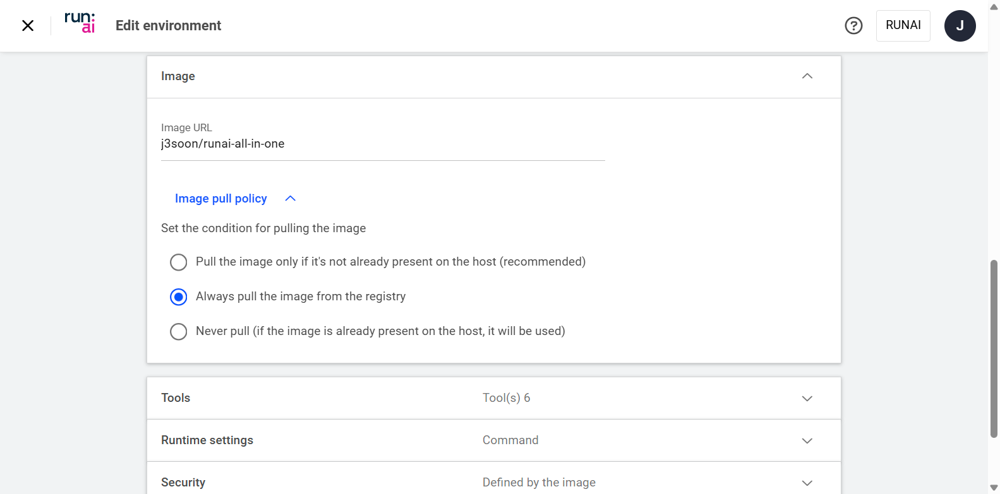

### Set Minimal Backoff Limit for Non-resumable Tasks

Auto-restarting is often not preferred for quick experiments

- Often, we just want to quickly train some code (without setting up checkpointing and resuming) or reproduce work from GitHub without having to implement resuming logic.
- Automatically restarting these workload may cause checkpoint overwrites and excessive GPU usage (e.g., submitting 20 workloads that runs 3-days each being restarted six times without producing any useful results)
- [Run:ai] Default backoff limit is 6. Current minimum is 1, should be changed to 0 in later versions. (slack)
- [Omniverse Farm] We’re still using OV Farm (with patch) for running batch workloads for now.

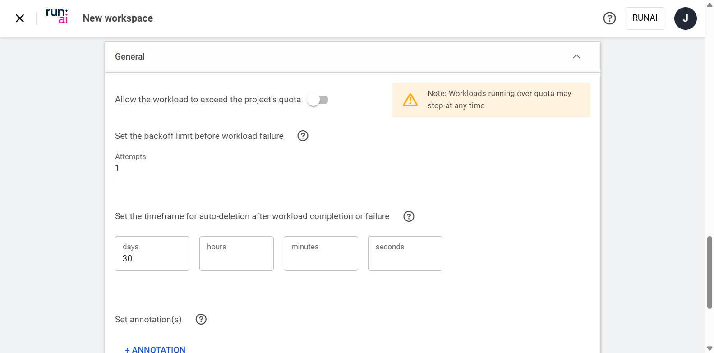

### Use Unbuffered Output for Logs

By default, outputs are often buffered and may not show in the logs GUI

[Run:ai] To view the logs in Run:ai GUI of headless workloads, set unbuffered for workload outputs. (e.g., `python3 -u main.py` or `export PYTHONUNBUFFERED=1`)

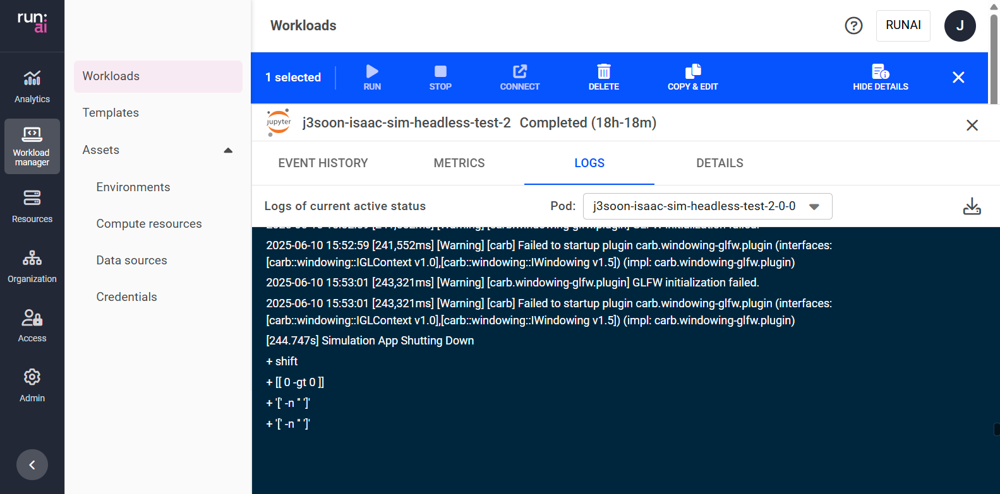

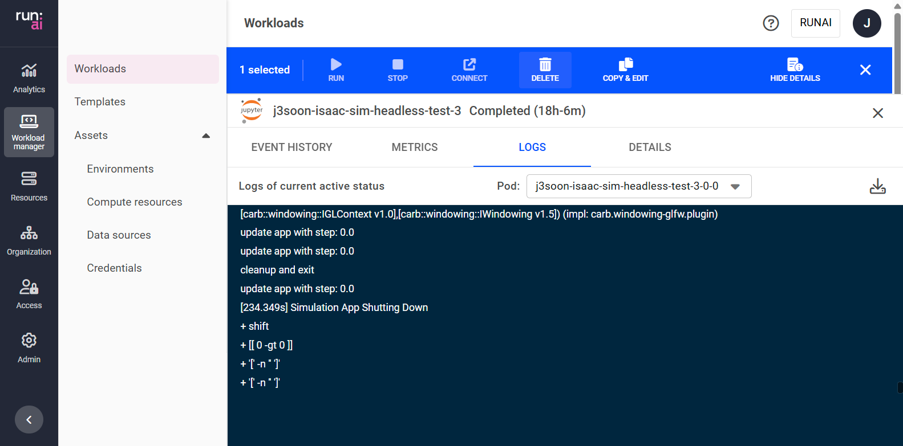

### Be Aware that Run:ai Tool URLs may Reorder Randomly

Happens when using multiple tools within a single environment

- Some trial-and-error may be needed for identifying the correct tool.
- [Run:ai] When using multiple tools within a single environment, the tool ports may be randomly reordered. (slack)


### Add Script to Chain Multiple Commands

Enable install-and-run style commands for faster prototyping

- Often, we want to run multiple commands upon start up. For example, running (mounted) updated code with new dependencies that isn’t in the Dockerfile (and we don’t want to rebuild and push it). (e.g., `pip install <new_package_name> && python3 main.py`)
- [K8s] K8s pods/containers only supports running a single command at launch by default.
- [Automate] Supported by default if using our [`/run.sh` script](https://github.com/j3soon/runai-isaac/blob/main/scripts/docker/run.sh).

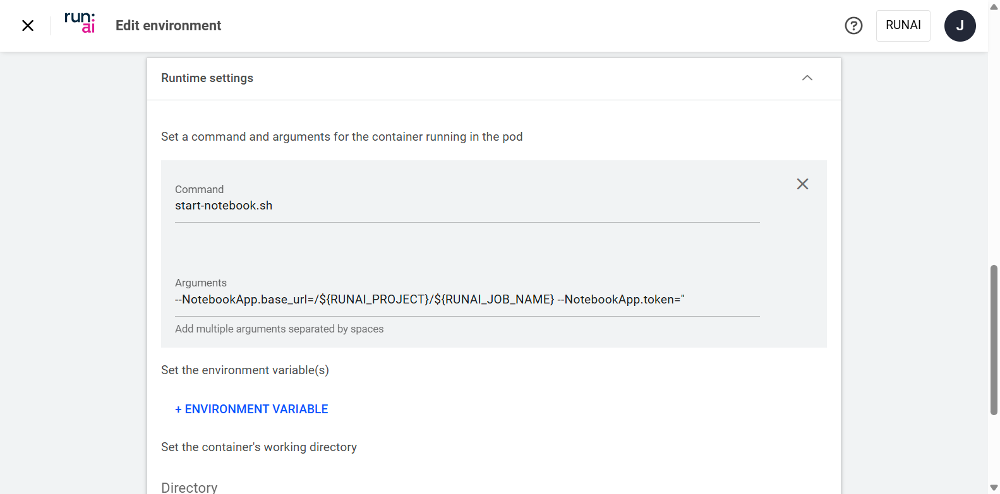
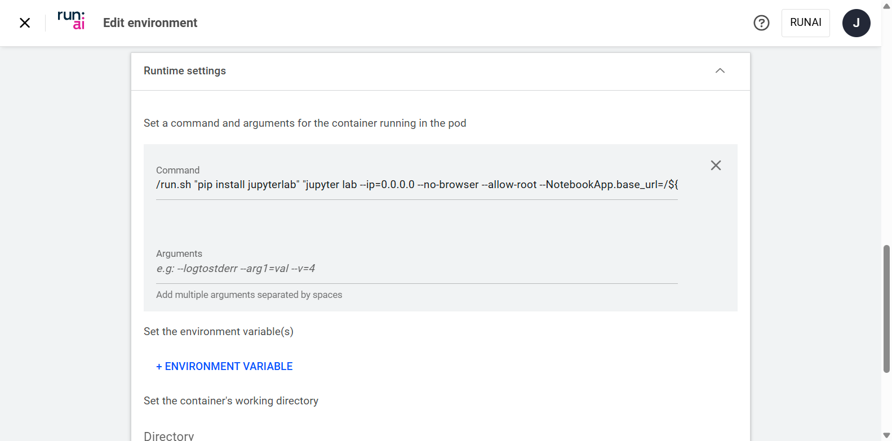

### Setup X11/OpenGL/Vulkan Support if Needed

Each of them requires special set up to work in containers

- [Docker] Follow our instructions to create dockerfiles for [local testing](https://github.com/j3soon/dockerfile-fragments) or [Run:ai VNC testing](https://github.com/j3soon/runai-isaac/blob/main/docker/all-in-one/Dockerfile).
- [Automate] Enabled by default if following [our all-in-one dockerfile](https://github.com/j3soon/runai-isaac/blob/main/docker/all-in-one/Dockerfile).

### Increase Container Soft ulimit

Increase number of open files and stack size

- [K8s] K8s pods/containers have very low soft ulimits by default, may need to increase them to prevent errors (e.g., dataloader `OSError: [Errno 24] Too many open files: 'XXX'`)
- Run `ulimit -n $(ulimit -Hn)` and `ulimit -s $(ulimit -Hs)`.
- [Automate] Applied automatically if using our [`/run.sh` script](https://github.com/j3soon/runai-isaac/blob/main/scripts/docker/run.sh).

```sh
# ulimit -a
real-time non-blocking time (microseconds, -R) unlimited
core file size (blocks, -c) unlimited
data seg size (kbytes, -d) unlimited
scheduling priority (-e) 0
file size (blocks, -f) unlimited
pending signals (-i) 4126326
max locked memory (kbytes, -l) 64
max memory size (kbytes, -m) unlimited
open files (-n) 1024
pipe size (512 bytes, -p) 8
POSIX message queues (bytes, -q) 819200
real-time priority (-r) 0
stack size (kbytes, -s) 8192
cpu time (seconds, -t) unlimited
max user processes (-u) unlimited
virtual memory (kbytes, -v) unlimited
file locks (-x) unlimited
```

```sh
# ulimit -Ha
real-time non-blocking time (microseconds, -R) unlimited
core file size (blocks, -c) unlimited
data seg size (kbytes, -d) unlimited
scheduling priority (-e) 0
file size (blocks, -f) unlimited
pending signals (-i) 4126326
max locked memory (kbytes, -l) 64
max memory size (kbytes, -m) unlimited
open files (-n) 524288
pipe size (512 bytes, -p) 8
POSIX message queues (bytes, -q) 819200
real-time priority (-r) 0
stack size (kbytes, -s) unlimited
cpu time (seconds, -t) unlimited
max user processes (-u) unlimited
virtual memory (kbytes, -v) unlimited
file locks (-x) unlimited
```

### Shell Scripts: Be Aware of Windows Line-endings and Permissions

Use Linux system to build containers can save you from Windows issues

- If editing shell scripts on Windows, ensure there are no windows line-endings and permissions are correctly set. (e.g., `/bin/bash: - : invalid option` and `bash: ./test.sh: Permission denied`).
- [Windows, Shell] Linux shell scripts assume LF (\n) line-endings instead of CRLF (\r\n) used in Windows. This difference is invisible in most editors, can be set visible in some editors (e.g., Notepad++).
- [Windows] Copying shell scripts to Windows may remove its permission settings.
- [NFS, FileZilla] Prevent automatic change of line-endings by [modify settings](https://github.com/j3soon/runai-isaac/tree/main?tab=readme-ov-file#jupyter-lab-with-custom-base-image).
- [Automate] Follow [our Dockerfile](https://github.com/j3soon/runai-isaac/blob/2feb4002382c7917c1802dd9d82d336916694149/docker/pytorch-mnist/Dockerfile#L7-L10) to automatically fix them if using Windows.

```
bash: ./test.sh: Permission denied
Process exited with return code: -1
```

```
/bin/bash: - : invalid option
Process exited with return code: -1
```

```
# Prevent users from accidentally removing the executable permission.
RUN chmod +x /omnicli/omnicli && chmod +x /run.sh
# Prevent users from accidentally saving script files with Windows line endings.
RUN sed -i 's/\r$//' /run.sh
```

### Disable Ownership Change for Tar Extract on NFS

Tar changes ownership by default, which is not allowed on NFS

- [NFS, Tar] When using `tar` on a mounted NFS volume, use the `--no-same-owner` flag to prevent errors. (e.g., `tar: XXX: Cannot change ownership to uid XXX, gid XXX: Operation not permitted`)

```
tar: XXX: Cannot change ownership to uid XXX, gid XXX: Operation not permitted
```

## Cluster Admin Perspective

### Create Non-default Node Pool for Users

Allow easy isolation and testing of failing nodes (new nodes are added to default node pool)

- Will need more node pools for heterogeneous environments (e.g., mix of H100 and L40 GPUs)
- [Run:ai] Labeling nodes require K8s `kubectl` access, no corresponding Run:ai GUI for admins

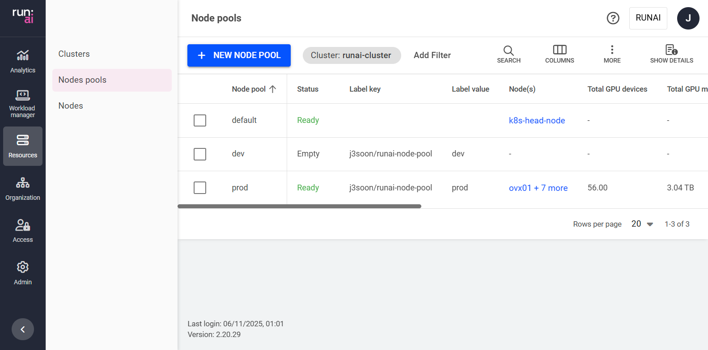

### Keep GPU Placement Strategy as Bin-Pack

Prevents GPU resource fragmentation (maximize GPU utilization)

- `Node pool > GPU placement strategy` to `Bin-pack` (default)

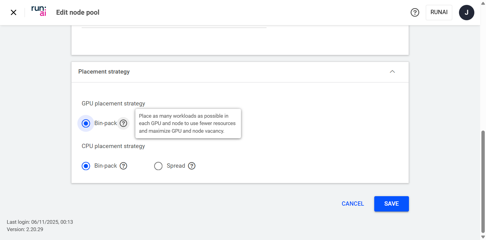

### Keep Over-quota Disabled and Over-subscribe GPUs

Allows non-preemptive GPU quota sharing across departments

- Setup was chosen despite [Run:ai's recommendation against it](https://run-ai-docs.nvidia.com/self-hosted/platform-management/aiinitiatives/adapting-ai-initiatives#assigning-your-resources), due to the following reasons:
- Our users are trusted and cooperative, we can coordinate resource usage through communication during peak time.
- Disable preemption saves everyone from the hassle of making their workloads preemptible.
- > "A non-preemptible workload is only scheduled if in-quota and cannot be preempted after being scheduled, not even by a higher priority workload." -- [Run:ai Docs](https://run-ai-docs.nvidia.com/self-hosted/platform-management/runai-scheduler/scheduling/concepts-and-principles#priority-and-preemption)
- Ask users to only use the `Workspace` type (unsure if this is necessary, will not work for multi-node workloads).
- [Run:ai] Must set `Order of priority` to prevent scheduling issues.

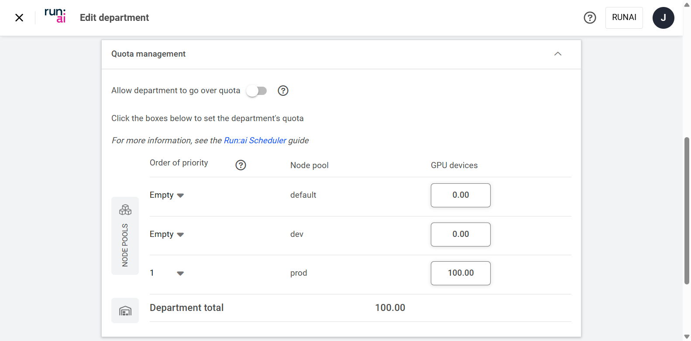
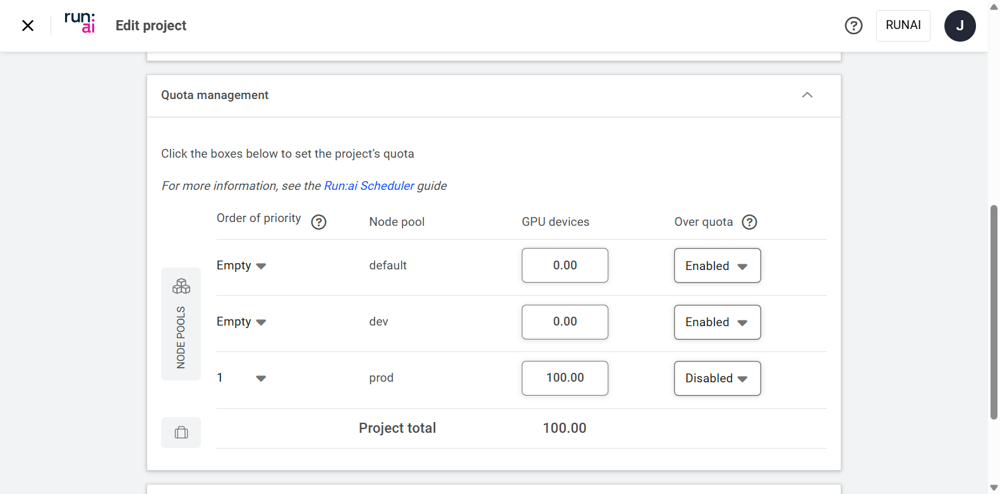

### Single Project within a Department and Adopt Workload Prefix

Allows workload access sharing and separation within a department

- Ask users to always prefix Environments, Templates, and Workloads with their unique username.
- [Run:ai] There are currently no way to know who created a particular workload within a project through GUI.
  > 2025/07 Update: There is a new `Created by` column in the `Workloads` tab.
- [Run:ai] Deletion of projects require K8s `kubectl` access, no corresponding Run:ai GUI for admins (slack)

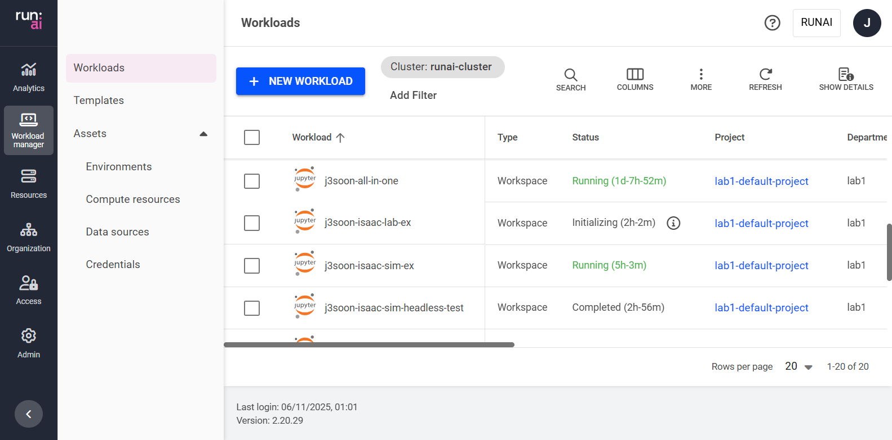

### Add Users with L2+Environment+Template Role and Project Scope

Minimal privileges while allowing custom docker images

- (+) L2 researcher: Minimal privileges to submit workload
- (+) Environment administrator: Privileges to use custom docker image and tools, will have side effect*
- (+) Template administrator: Privileges to use template for fast workload creation, will have side effect*
- (-) L1 researcher: Too many privileges (e.g., compute resources, credentials, data sources, data volumes)
- [Run:ai] Many roles include an unwanted side effect that provide access to `Analytics dashboard` (can view node names, global GPU usages, global department/project names and usages, and all emails of users with active workloads). There are currently no way to create custom roles through GUI. (slack, [note](https://github.com/j3soon/runai-isaac/blob/main/install.md#access))
- [Automate] Easy batch creation of users and role assignment can be done with our [`create_user.sh` script](https://github.com/j3soon/runai-isaac/blob/main/scripts/admin/create_user.sh).

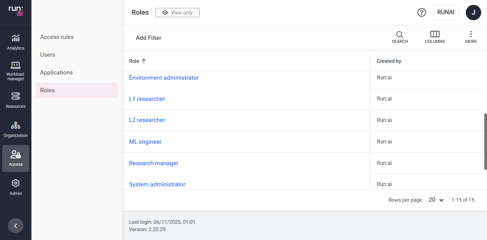

### Add Compute Resources with 0~8 GPUs and Increase Shared Memory Size

Large shared memory is often required for multi-GPU training

- Enable`Increase shared memory size` when creating compute resources. (think `--ipc=host`, `--shm-size`, `/dev/shm`)
- [Automate] Easy creation of 9 compute resources (increased shared memory) with our `create_compute.sh` script.
- [Automate*] API docs and `Network` developer tools in the browser can both help script writing.

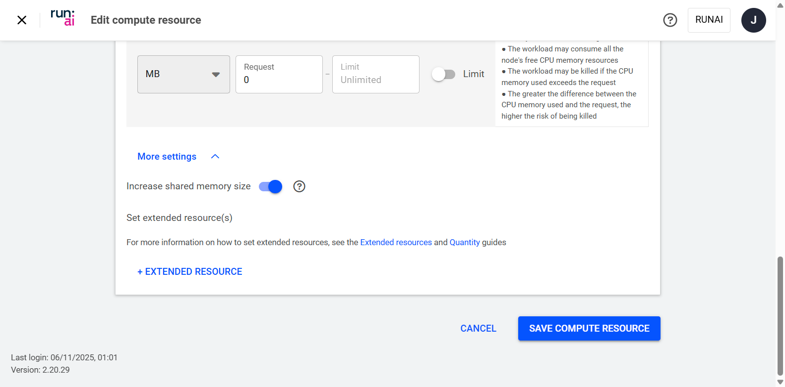

### Create Data Source and Set Scope as Department

To allow easy file sharing across users within a department

- Storage that allow direct container read/write and user upload/download is vital. (previously only Omniverse Nucleus)
- [Admin] We use NFS and FTP(S) for simplicity, although other data sources may be more secure and preferable.

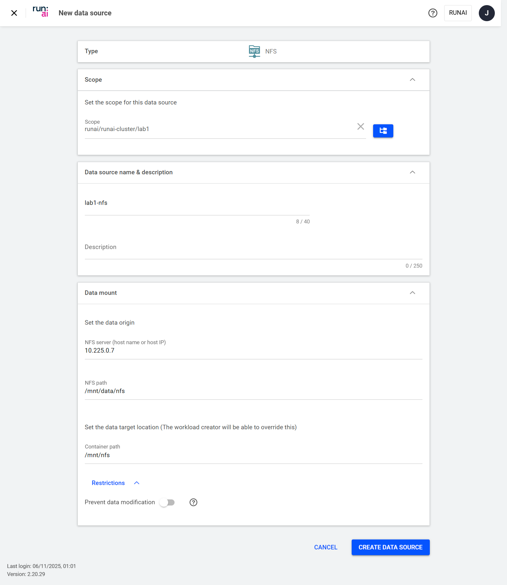

### Tips on Resolving Node/GPU/Run:ai Failure

Be aware of the different levels of issue sources: System, K8s, and Run:ai.

- Example Issues: (1) Workloads cannot be scheduled to a certain node (2) Run:ai errors or failures
- Node Issues: Rebooting nodes or draining and rejoining often resolves the problem. (e.g., uncorrectable ECC error)
- Run:ai Issues: Check the status and logs of all related pods. Note any errors, then attempt to delete the affected pods (they will restart automatically).
- Use ChatGPT + K8s GUI tools (e.g., [freelens](https://github.com/freelensapp/freelens)) to allow quick inspection and debugging
- Study K8s docs and [KodeKloud CKAD course](https://www.udemy.com/course/certified-kubernetes-application-developer/) on Udemy business (free if subscribed) when necessary.

```sh
ssh <NODE_USER>@<NODE_IP>
sudo reboot
```

```sh
# on head node
kubectl drain <NODE_NAME> --ignore-daemonsets --delete-local-data
kubectl delete node <NODE_NAME>
sudo kubeadm token create --print-join-command
# on worker node
sudo kubeadm reset
# and then paste the join command (with sudo)
```

```sh
kubectl get pods -A | grep runai
```

```sh
kubectl delete pod -n runai cluster-sync
kubectl delete pod -n runai runai-agent
kubectl delete pod -n runai-backend keycloak-0
```

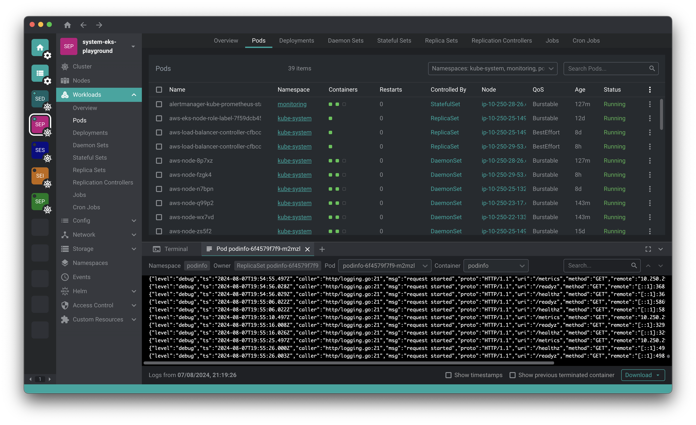
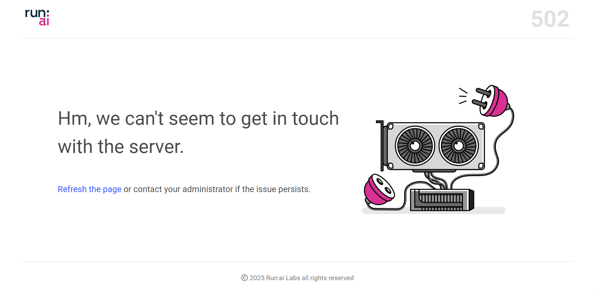

## Limitations and Future Work

- Limitations
  - [Run:ai] Creation of Compose-style/Helm charts/Blueprints workloads doesn’t seem to be supported yet.
  - [Admin] Haven’t tested isolation of CPU/Memory/Storage IO/Network IO/etc.
  - [OV] Omniverse Kit App Streaming workload cannot be easily deployed due to its design. (slack)
- Future Works (for myself)
  - User guide for submitting batch of workloads through CLI/API instead of GUI.
  - Hosting a persistent NIM while allowing other workloads to send API requests.
  - Test multi-node (distributed) training.
  - Shared storage for common dataset and model checkpoints.
  - Check Isaac Sim performance in VNC in container.
  - Test better data source solution aside from NFS (such as S3?)
  - Test better service expose methods aside from NodePort (is External URL general enough?)
