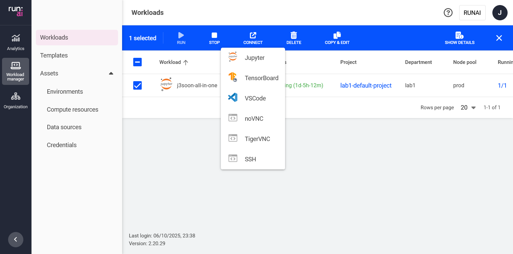
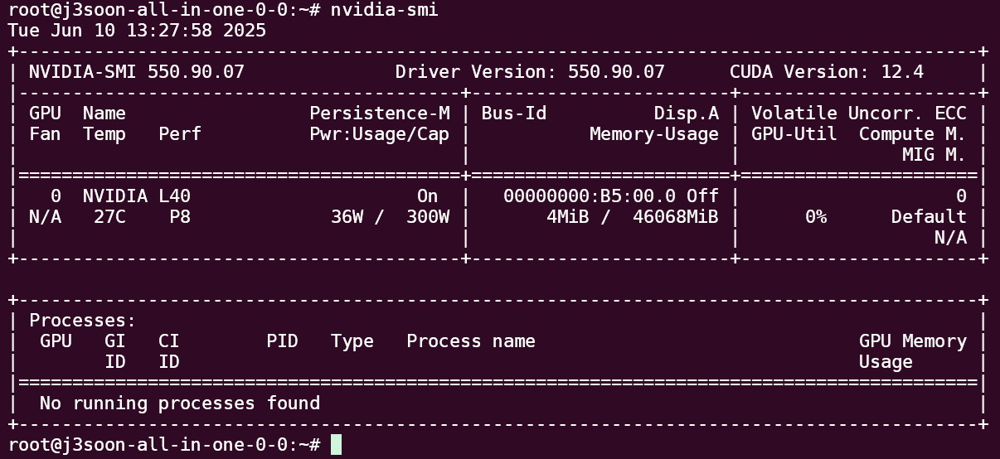
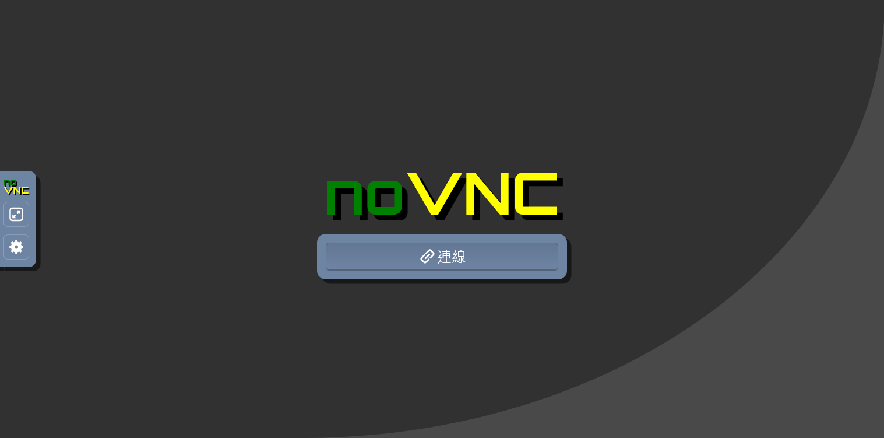
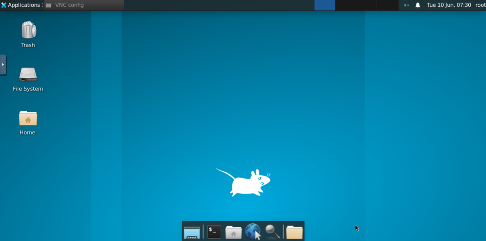
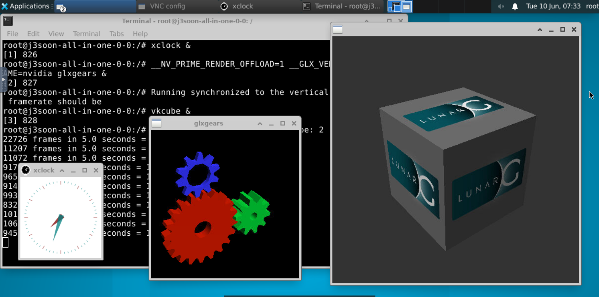
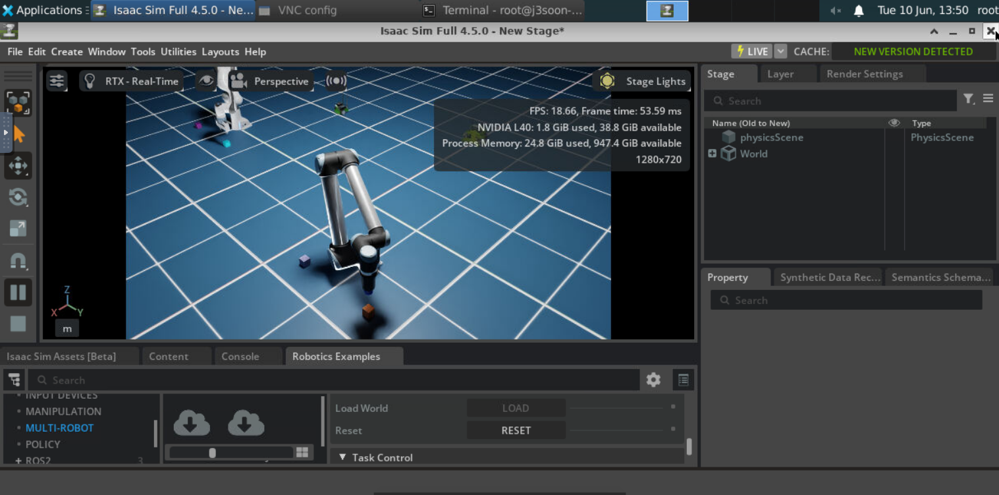
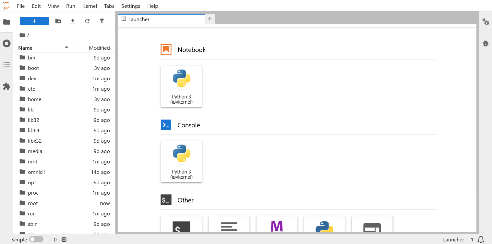
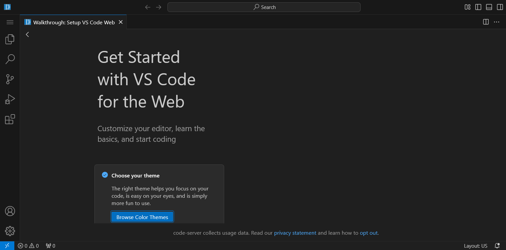

# Tools

This is the tools showcase page. For instructions, please refer to [the Applications section](./applications/README.md).




## SSH



## VNC






## Jupyter Lab



## VSCode



## OBS Studio

If using the `all-in-one` docker image, you can use the following command to [install OBS Studio](https://obsproject.com/kb/linux-installation):

```sh
apt-get update
apt-get install -y software-properties-common
add-apt-repository ppa:obsproject/obs-studio
apt-get install -y obs-studio
```

Then launch it through the VNC desktop menu.

## Others

Such as TensorBoard, Viser, etc.
